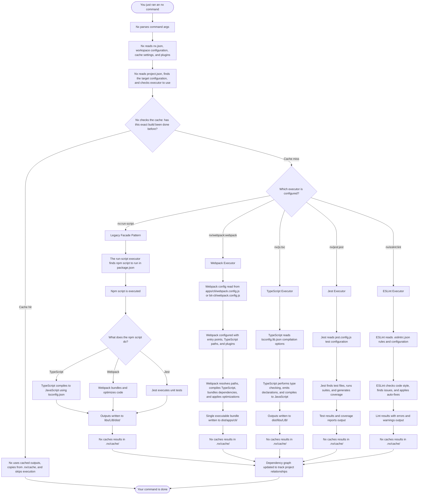

# Agent Shell Transcript

**Agent:** Claude Code
**Started:** 2026-01-13 10:30:50
**Working Directory:** /Users/me/binwarden/bitwarden-clients/bitwarden-init-test/

---

## User (2026-01-13 10:30:58)

/plugin marketplace add /Users/me/binwarden/bitwarden-ai-plugins/main

## User (2026-01-13 10:30:59)

/plugin install bitwarden-init@bitwarden-marketplace

## User (2026-01-13 10:31:03)

/init

## Agent (2026-01-13 10:31:05)

Bobert will analyze this codebase to create a comprehensive CLAUDE.md file. Let Bobert start by exploring the repository structure and key documentation files.

### Tool Call [completed]: Read /Users/me/binwarden/bitwarden-clients/bitwarden-init-test/README.md

**Tool:** read
**Timestamp:** 2026-01-13 10:31:09

```
<p align="center">
  
</p>
<p align="center">
  <a href="https://github.com/bitwarden/clients/actions/workflows/build-browser.yml?query=branch:main" target="_blank"></a>
  <a href="https://github.com/bitwarden/clients/actions/workflows/build-cli.yml?query=branch:main" target="_blank"></a>
  <a href="https://github.com/bitwarden/clients/actions/workflows/build-desktop.yml?query=branch:main" target="_blank"></a>
  <a href="https://github.com/bitwarden/clients/actions/workflows/build-web.yml?query=branch:main" target="_blank"></a>
  <a href="https://gitter.im/bitwarden/Lobby" target="_blank"></a>
</p>

---

# Bitwarden Client Applications

This repository houses all Bitwarden client applications except the mobile applications ([iOS](https://github.com/bitwarden/ios) | [android](https://github.com/bitwarden/android)).

Please refer to the [Clients section](https://contributing.bitwarden.com/getting-started/clients/) of the [Contributing Documentation](https://contributing.bitwarden.com/) for build instructions, recommended tooling, code style tips, and lots of other great information to get you started.

## Related projects:

- [bitwarden/server](https://github.com/bitwarden/server): The core infrastructure backend (API, database, Docker, etc).
- [bitwarden/ios](https://github.com/bitwarden/ios): Bitwarden iOS Password Manager & Authenticator apps.
- [bitwarden/android](https://github.com/bitwarden/android): Bitwarden Android Password Manager & Authenticator apps.
- [bitwarden/directory-connector](https://github.com/bitwarden/directory-connector): A tool for syncing a directory (AD, LDAP, Azure, G Suite, Okta) to an organization.

# We're Hiring!

Interested in contributing in a big way? Consider joining our team! We're hiring for many positions. Please take a look at our [Careers page](https://bitwarden.com/careers/) to see what opportunities are [currently open](https://bitwarden.com/careers/#open-positions) as well as what it's like to work at Bitwarden.

# Contribute

Code contributions are welcome! Please commit any pull requests against the `main` branch. Learn more about how to contribute by reading the [Contributing Guidelines](https://contributing.bitwarden.com/contributing/). Check out the [Contributing Documentation](https://contributing.bitwarden.com/) for how to get started with your first contribution.

Security audits and feedback are welcome. Please open an issue or email us privately if the report is sensitive in nature. You can read our security policy in the [`SECURITY.md`](SECURITY.md) file.
```


### Tool Call [completed]: Read /Users/me/binwarden/bitwarden-clients/bitwarden-init-test/package.json

**Tool:** read
**Timestamp:** 2026-01-13 10:31:09

```
{
  "name": "@bitwarden/clients",
  "version": "0.0.0",
  "description": "Bitwarden Client Applications",
  "repository": {
    "type": "git",
    "url": "git+https://github.com/bitwarden/clients.git"
  },
  "author": "Bitwarden Inc. <hello@bitwarden.com> (https://bitwarden.com)",
  "license": "GPL-3.0",
  "bugs": {
    "url": "https://github.com/bitwarden/clients/issues"
  },
  "homepage": "https://bitwarden.com",
  "scripts": {
    "prepare": "husky",
    "lint": "eslint . --cache --cache-strategy content && prettier --check .",
    "lint:fix": "eslint . --cache --cache-strategy content --fix",
    "lint:clear": "rimraf .eslintcache",
    "prettier": "prettier --cache --write .",
    "test": "jest",
    "test:watch": "jest --clearCache && jest --watch",
    "test:watch:all": "jest --watchAll",
    "test:types": "node ./scripts/test-types.js",
    "test:locales": "tsc --project ./scripts/tsconfig.json && node ./scripts/dist/test-locales.js",
    "lint:dep-ownership": "tsc --project ./scripts/tsconfig.json && node ./scripts/dist/dep-ownership.js",
    "lint:sdk-internal-versions": "tsc --project ./scripts/tsconfig.json && node ./scripts/dist/sdk-internal-versions.js",
    "docs:json": "compodoc -p ./tsconfig.json -e json -d . --disableRoutesGraph",
    "storybook": "ng run components:storybook",
    "build-storybook": "ng run components:build-storybook",
    "build-storybook:ci": "ng run components:build-storybook --webpack-stats-json",
    "test-stories": "test-storybook --url http://localhost:6006",
    "test-stories:watch": "test-stories --watch"
  },
  "workspaces": [
    "apps/*",
    "apps/desktop/desktop_native/napi",
    "libs/**/*"
  ],
  "devDependencies": {
    "@angular-devkit/build-angular": "20.3.12",
    "@angular-eslint/schematics": "20.7.0",
    "@angular/cli": "20.3.12",
    "@angular/compiler-cli": "20.3.15",
    "@babel/core": "7.28.5",
    "@babel/preset-env": "7.28.5",
    "@compodoc/compodoc": "1.1.32",
    "@electron/notarize": "3.0.1",
    "@electron/rebuild": "4.0.1",
    "@eslint/compat": "2.0.0",
    "@lit-labs/signals": "0.2.0",
    "@ngtools/webpack": "20.3.12",
    "@nx/devkit": "21.6.10",
    "@nx/eslint": "21.6.10",
    "@nx/jest": "21.6.10",
    "@nx/js": "21.6.10",
    "@nx/webpack": "21.6.10",
    "@storybook/addon-a11y": "9.1.16",
    "@storybook/addon-designs": "9.0.0-next.3",
    "@storybook/addon-docs": "9.1.16",
    "@storybook/addon-links": "9.1.16",
    "@storybook/addon-themes": "9.1.16",
    "@storybook/angular": "9.1.16",
    "@storybook/test-runner": "0.22.0",
    "@storybook/web-components-vite": "9.1.16",
    "@tailwindcss/container-queries": "0.1.1",
    "@types/chrome": "0.1.28",
    "@types/firefox-webext-browser": "143.0.0",
    "@types/inquirer": "8.2.10",
    "@types/jest": "29.5.14",
    "@types/jsdom": "21.1.7",
    "@types/koa": "3.0.1",
    "@types/koa__multer": "2.0.7",
    "@types/koa__router": "12.0.4",
    "@types/koa-bodyparser": "4.3.7",
    "@types/koa-json": "2.0.23",
    "@types/lowdb": "1.0.15",
    "@types/lunr": "2.3.7",
    "@types/node": "22.19.3",
    "@types/node-fetch": "2.6.4",
    "@types/node-forge": "1.3.14",
    "@types/papaparse": "5.5.0",
    "@types/proper-lockfile": "4.1.4",
    "@types/retry": "0.12.5",
    "@types/zxcvbn": "4.4.5",
    "@typescript-eslint/rule-tester": "8.31.0",
    "@typescript-eslint/utils": "8.31.0",
    "@webcomponents/custom-elements": "1.6.0",
    "@yao-pkg/pkg": "6.5.1",
    "angular-eslint": "20.7.0",
    "autoprefixer": "10.4.22",
    "axe-playwright": "2.2.2",
    "babel-loader": "9.2.1",
    "base64-loader": "1.0.0",
    "browserslist": "4.28.1",
    "chromatic": "13.3.4",
    "concurrently": "9.2.0",
    "copy-webpack-plugin": "13.0.1",
    "cross-env": "10.1.0",
    "css-loader": "7.1.2",
    "electron": "39.2.6",
    "electron-builder": "26.0.12",
    "electron-log": "5.4.3",
    "electron-reload": "2.0.0-alpha.1",
    "electron-store": "8.2.0",
    "electron-updater": "6.6.4",
    "eslint": "9.26.0",
    "eslint-config-prettier": "10.1.2",
    "eslint-import-resolver-typescript": "4.3.4",
    "eslint-plugin-import": "2.31.0",
    "eslint-plugin-rxjs": "5.0.3",
    "eslint-plugin-rxjs-angular": "2.0.1",
    "eslint-plugin-storybook": "9.1.16",
    "eslint-plugin-tailwindcss": "3.18.0",
    "html-loader": "5.1.0",
    "html-webpack-injector": "1.1.4",
    "html-webpack-plugin": "5.6.5",
    "husky": "9.1.7",
    "jest-diff": "30.2.0",
    "jest-junit": "16.0.0",
    "jest-mock-extended": "3.0.7",
    "jest-preset-angular": "14.6.1",
    "json5": "2.2.3",
    "lint-staged": "16.0.0",
    "mini-css-extract-plugin": "2.9.4",
    "nx": "21.6.10",
    "path-browserify": "1.0.1",
    "postcss": "8.5.6",
    "postcss-loader": "8.2.0",
    "prettier": "3.7.3",
    "prettier-plugin-tailwindcss": "0.7.1",
    "process": "0.11.10",
    "remark-gfm": "4.0.1",
    "rimraf": "6.1.2",
    "sass": "1.95.1",
    "sass-loader": "16.0.6",
    "storybook": "9.1.17",
    "style-loader": "4.0.0",
    "tailwindcss": "3.4.18",
    "ts-jest": "29.4.5",
    "ts-loader": "9.5.4",
    "tsconfig-paths-webpack-plugin": "4.2.0",
    "type-fest": "2.19.0",
    "typescript": "5.8.3",
    "typescript-eslint": "8.31.0",
    "typescript-strict-plugin": "2.4.4",
    "url": "0.11.4",
    "util": "0.12.5",
    "wait-on": "9.0.3",
    "webpack": "5.103.0",
    "webpack-cli": "6.0.1",
    "webpack-dev-server": "5.2.2",
    "webpack-node-externals": "3.0.0"
  },
  "dependencies": {
    "@angular/animations": "20.3.15",
    "@angular/cdk": "20.2.14",
    "@angular/common": "20.3.15",
    "@angular/compiler": "20.3.15",
    "@angular/core": "20.3.15",
    "@angular/forms": "20.3.15",
    "@angular/platform-browser": "20.3.15",
    "@angular/platform-browser-dynamic": "20.3.15",
    "@angular/router": "20.3.15",
    "@bitwarden/sdk-internal": "0.2.0-main.450",
    "@bitwarden/commercial-sdk-internal": "0.2.0-main.450",
    "@electron/fuses": "1.8.0",
    "@emotion/css": "11.13.5",
    "@koa/multer": "4.0.0",
    "@koa/router": "14.0.0",
    "@microsoft/signalr": "8.0.7",
    "@microsoft/signalr-protocol-msgpack": "8.0.7",
    "@ng-select/ng-select": "20.7.0",
    "big-integer": "1.6.52",
    "braintree-web-drop-in": "1.46.0",
    "buffer": "6.0.3",
    "bufferutil": "4.1.0",
    "chalk": "4.1.2",
    "commander": "14.0.0",
    "core-js": "3.47.0",
    "form-data": "4.0.4",
    "https-proxy-agent": "7.0.6",
    "inquirer": "8.2.6",
    "jsdom": "26.1.0",
    "jszip": "3.10.1",
    "koa": "3.1.1",
    "koa-bodyparser": "4.4.1",
    "koa-json": "2.0.2",
    "lit": "3.3.1",
    "lowdb": "1.0.0",
    "lunr": "2.3.9",
    "multer": "2.0.2",
    "ngx-toastr": "19.1.0",
    "node-fetch": "2.6.12",
    "node-forge": "1.3.2",
    "oidc-client-ts": "2.4.1",
    "open": "11.0.0",
    "papaparse": "5.5.3",
    "proper-lockfile": "4.1.2",
    "qrcode-parser": "2.1.3",
    "qrious": "4.0.2",
    "rxjs": "7.8.1",
    "semver": "7.7.3",
    "tabbable": "6.3.0",
    "tldts": "7.0.19",
    "ts-node": "10.9.2",
    "utf-8-validate": "6.0.5",
    "vite-tsconfig-paths": "5.1.4",
    "zone.js": "0.15.1",
    "zxcvbn": "4.4.2"
  },
  "overrides": {
    "eslint-plugin-rxjs": {
      "eslint": "$eslint"
    },
    "eslint-plugin-rxjs-angular": {
      "eslint": "$eslint"
    },
    "tailwindcss": "$tailwindcss",
    "react": "18.3.1",
    "react-dom": "18.3.1",
    "@types/react": "18.3.27"
  },
  "lint-staged": {
    "*": "prettier --cache --ignore-unknown --write",
    "*.ts": "eslint --cache --cache-strategy content --fix"
  },
  "engines": {
    "node": ">=22.12.0",
    "npm": "~10"
  }
}
```


### Tool Call [completed]: `ls -la /Users/me/binwarden/bitwarden-clients/bitwarden-init-test`

**Tool:** execute
**Timestamp:** 2026-01-13 10:31:09
**Description:** List root directory contents
**Command:** ls -la /Users/me/binwarden/bitwarden-clients/bitwarden-init-test

```
total 3496
drwxr-xr-x@ 44 me  staff     1408 Jan 13 10:30 .
drwxr-xr-x  28 me  staff      896 Jan 13 10:29 ..
drwxr-xr-x@  3 me  staff       96 Jan 13 10:30 .agent-shell
-rw-r--r--@  1 me  staff       53 Jan 13 10:29 .browserslistrc
drwxr-xr-x@  3 me  staff       96 Jan 13 10:29 .checkmarx
drwxr-xr-x@  3 me  staff       96 Jan 13 10:30 .claude
drwxr-xr-x@  3 me  staff       96 Jan 13 10:29 .codescene
-rw-r--r--@  1 me  staff      359 Jan 13 10:29 .editorconfig
-rw-r--r--@  1 me  staff       86 Jan 13 10:29 .git
-rw-r--r--@  1 me  staff     1394 Jan 13 10:29 .git-blame-ignore-revs
-rw-r--r--@  1 me  staff       19 Jan 13 10:29 .gitattributes
drwxr-xr-x@ 10 me  staff      320 Jan 13 10:29 .github
-rw-r--r--@  1 me  staff      745 Jan 13 10:29 .gitignore
drwxr-xr-x@  4 me  staff      128 Jan 13 10:29 .husky
-rw-r--r--@  1 me  staff      187 Jan 13 10:29 .npmrc
-rw-r--r--@  1 me  staff        4 Jan 13 10:29 .nvmrc
-rw-r--r--@  1 me  staff      568 Jan 13 10:29 .prettierignore
-rw-r--r--@  1 me  staff      139 Jan 13 10:29 .prettierrc.json
drwxr-xr-x@  9 me  staff      288 Jan 13 10:29 .storybook
drwxr-xr-x@  4 me  staff      128 Jan 13 10:29 .vscode
-rw-r--r--@  1 me  staff     7261 Jan 13 10:29 angular.json
drwxr-xr-x@  6 me  staff      192 Jan 13 10:29 apps
-rw-r--r--@  1 me  staff      156 Jan 13 10:29 babel.config.json
drwxr-xr-x@  7 me  staff      224 Jan 13 10:29 bitwarden_license
-rw-r--r--@  1 me  staff     2084 Jan 13 10:29 clients.code-workspace
-rw-r--r--@  1 me  staff      313 Jan 13 10:29 CONTRIBUTING.md
drwxr-xr-x@  3 me  staff       96 Jan 13 10:29 docs
-rw-r--r--@  1 me  staff    22481 Jan 13 10:29 eslint.config.mjs
-rw-r--r--@  1 me  staff     3047 Jan 13 10:29 jest.config.js
-rw-r--r--@  1 me  staff       88 Jan 13 10:29 jest.preset.js
drwxr-xr-x@ 37 me  staff     1184 Jan 13 10:29 libs
-rw-r--r--@  1 me  staff    10724 Jan 13 10:29 LICENSE_BITWARDEN.txt
-rw-r--r--@  1 me  staff    35140 Jan 13 10:29 LICENSE_GPL.txt
-rw-r--r--@  1 me  staff      820 Jan 13 10:29 LICENSE.txt
-rw-r--r--@  1 me  staff     1018 Jan 13 10:29 nx.json
-rw-r--r--@  1 me  staff  1603068 Jan 13 10:29 package-lock.json
-rw-r--r--@  1 me  staff     7582 Jan 13 10:29 package.json
-rw-r--r--@  1 me  staff     3337 Jan 13 10:29 README.md
drwxr-xr-x@  7 me  staff      224 Jan 13 10:29 scripts
-rw-r--r--@  1 me  staff     1794 Jan 13 10:29 SECURITY.md
-rw-r--r--@  1 me  staff      714 Jan 13 10:29 tailwind.config.js
-rw-r--r--@  1 me  staff     3943 Jan 13 10:29 tsconfig.base.json
-rw-r--r--@  1 me  staff      386 Jan 13 10:29 tsconfig.eslint.json
-rw-r--r--@  1 me  staff      434 Jan 13 10:29 tsconfig.json
```


### Tool Call [completed]: Find `**/.cursorrules`

**Tool:** search
**Timestamp:** 2026-01-13 10:31:09

```
No files found
```


### Tool Call [completed]: Find `**/.cursor/rules/**`

**Tool:** search
**Timestamp:** 2026-01-13 10:31:09

```
No files found
```


### Tool Call [completed]: Find `**/.github/copilot-instructions.md`

**Tool:** search
**Timestamp:** 2026-01-13 10:31:09

```
No files found
```
## Agent (2026-01-13 10:31:11)

Now let Bobert explore the contributing documentation and examine the codebase structure:

### Tool Call [completed]: Read /Users/me/binwarden/bitwarden-clients/bitwarden-init-test/CONTRIBUTING.md

**Tool:** read
**Timestamp:** 2026-01-13 10:31:16

```
# How to Contribute

Our [Contributing Guidelines](https://contributing.bitwarden.com/contributing/) are located in our [Contributing Documentation](https://contributing.bitwarden.com/). The documentation also includes recommended tooling, code style tips, and lots of other great information to get you started.
```


### Tool Call [completed]: `ls -la /Users/me/binwarden/bitwarden-clients/bitwarden-init-test/apps`

**Tool:** execute
**Timestamp:** 2026-01-13 10:31:16
**Description:** List apps directory
**Command:** ls -la /Users/me/binwarden/bitwarden-clients/bitwarden-init-test/apps

```
total 0
drwxr-xr-x@  6 me  staff   192 Jan 13 10:29 .
drwxr-xr-x@ 44 me  staff  1408 Jan 13 10:30 ..
drwxr-xr-x@ 23 me  staff   736 Jan 13 10:29 browser
drwxr-xr-x@ 20 me  staff   640 Jan 13 10:29 cli
drwxr-xr-x@ 32 me  staff  1024 Jan 13 10:29 desktop
drwxr-xr-x@ 26 me  staff   832 Jan 13 10:29 web
```


### Tool Call [completed]: `ls -la /Users/me/binwarden/bitwarden-clients/bitwarden-init-test/libs`

**Tool:** execute
**Timestamp:** 2026-01-13 10:31:16
**Description:** List libs directory
**Command:** ls -la /Users/me/binwarden/bitwarden-clients/bitwarden-init-test/libs

```
total 0
drwxr-xr-x@ 37 me  staff  1184 Jan 13 10:29 .
drwxr-xr-x@ 44 me  staff  1408 Jan 13 10:30 ..
drwxr-xr-x@  3 me  staff    96 Jan 13 10:29 .vscode
drwxr-xr-x@ 10 me  staff   320 Jan 13 10:29 admin-console
drwxr-xr-x@  9 me  staff   288 Jan 13 10:29 angular
drwxr-xr-x@ 12 me  staff   384 Jan 13 10:29 assets
drwxr-xr-x@ 10 me  staff   320 Jan 13 10:29 auth
drwxr-xr-x@ 13 me  staff   416 Jan 13 10:29 auto-confirm
drwxr-xr-x@ 10 me  staff   320 Jan 13 10:29 billing
drwxr-xr-x@ 12 me  staff   384 Jan 13 10:29 client-type
drwxr-xr-x@ 11 me  staff   352 Jan 13 10:29 common
drwxr-xr-x@ 13 me  staff   416 Jan 13 10:29 components
drwxr-xr-x@ 12 me  staff   384 Jan 13 10:29 core-test-utils
drwxr-xr-x@  3 me  staff    96 Jan 13 10:29 dirt
drwxr-xr-x@ 10 me  staff   320 Jan 13 10:29 eslint
drwxr-xr-x@ 12 me  staff   384 Jan 13 10:29 guid
drwxr-xr-x@  8 me  staff   256 Jan 13 10:29 importer
drwxr-xr-x@ 10 me  staff   320 Jan 13 10:29 key-management
drwxr-xr-x@ 10 me  staff   320 Jan 13 10:29 key-management-ui
drwxr-xr-x@ 12 me  staff   384 Jan 13 10:29 logging
drwxr-xr-x@ 12 me  staff   384 Jan 13 10:29 messaging
drwxr-xr-x@  9 me  staff   288 Jan 13 10:29 node
drwxr-xr-x@ 14 me  staff   448 Jan 13 10:29 nx-plugin
drwxr-xr-x@ 10 me  staff   320 Jan 13 10:29 platform
drwxr-xr-x@ 11 me  staff   352 Jan 13 10:29 pricing
drwxr-xr-x@ 12 me  staff   384 Jan 13 10:29 serialization
drwxr-xr-x@  8 me  staff   256 Jan 13 10:29 shared
drwxr-xr-x@ 13 me  staff   416 Jan 13 10:29 state
drwxr-xr-x@ 12 me  staff   384 Jan 13 10:29 state-internal
drwxr-xr-x@ 12 me  staff   384 Jan 13 10:29 state-test-utils
drwxr-xr-x@ 12 me  staff   384 Jan 13 10:29 storage-core
drwxr-xr-x@ 12 me  staff   384 Jan 13 10:29 storage-test-utils
drwxr-xr-x@ 13 me  staff   416 Jan 13 10:29 subscription
drwxr-xr-x@  6 me  staff   192 Jan 13 10:29 tools
drwxr-xr-x@  4 me  staff   128 Jan 13 10:29 ui
drwxr-xr-x@ 12 me  staff   384 Jan 13 10:29 user-core
drwxr-xr-x@ 10 me  staff   320 Jan 13 10:29 vault
```


### Tool Call [completed]: Read /Users/me/binwarden/bitwarden-clients/bitwarden-init-test/.vscode/settings.json

**Tool:** read
**Timestamp:** 2026-01-13 10:31:16

```
{
  "cSpell.words": ["Csprng", "Decapsulation", "decryptable", "Popout", "Reprompt", "takeuntil"],
  "search.exclude": {
    "**/locales/[^e]*/messages.json": true,
    "**/locales/*[^n]/messages.json": true,
    "**/_locales/[^e]*/messages.json": true,
    "**/_locales/*[^n]/messages.json": true
  },
  "rust-analyzer.linkedProjects": ["apps/desktop/desktop_native/Cargo.toml"],
  "typescript.tsdk": "node_modules/typescript/lib",
  "eslint.useFlatConfig": true
}
```
## Agent (2026-01-13 10:31:18)

Let Bobert explore a bit more about the architecture and build configurations:

### Tool Call [completed]: Read /Users/me/binwarden/bitwarden-clients/bitwarden-init-test/apps/browser/package.json

**Tool:** read
**Timestamp:** 2026-01-13 10:31:22

```
{
  "name": "@bitwarden/browser",
  "version": "2025.12.1",
  "scripts": {
    "build": "npm run build:chrome",
    "build:bit": "npm run build:bit:chrome",
    "build:chrome": "cross-env BROWSER=chrome MANIFEST_VERSION=3 NODE_OPTIONS=\"--max-old-space-size=8192\" webpack",
    "build:bit:chrome": "cross-env BROWSER=chrome MANIFEST_VERSION=3 NODE_OPTIONS=\"--max-old-space-size=8192\" webpack -c ../../bitwarden_license/bit-browser/webpack.config.js",
    "build:dev:chrome": "npm run build:chrome && npm run update:dev:chrome",
    "build:bit:dev:chrome": "npm run build:bit:chrome && npm run update:dev:chrome",
    "build:edge": "cross-env BROWSER=edge MANIFEST_VERSION=3 NODE_OPTIONS=\"--max-old-space-size=8192\" webpack",
    "build:bit:edge": "cross-env BROWSER=edge MANIFEST_VERSION=3 NODE_OPTIONS=\"--max-old-space-size=8192\" webpack -c ../../bitwarden_license/bit-browser/webpack.config.js",
    "build:firefox": "cross-env BROWSER=firefox NODE_OPTIONS=\"--max-old-space-size=8192\" webpack",
    "build:bit:firefox": "cross-env BROWSER=firefox NODE_OPTIONS=\"--max-old-space-size=8192\" webpack -c ../../bitwarden_license/bit-browser/webpack.config.js",
    "build:opera": "cross-env BROWSER=opera MANIFEST_VERSION=3 NODE_OPTIONS=\"--max-old-space-size=8192\" webpack",
    "build:bit:opera": "cross-env BROWSER=opera MANIFEST_VERSION=3 NODE_OPTIONS=\"--max-old-space-size=8192\" webpack -c ../../bitwarden_license/bit-browser/webpack.config.js",
    "build:safari": "cross-env BROWSER=safari NODE_OPTIONS=\"--max-old-space-size=8192\" webpack",
    "build:bit:safari": "cross-env BROWSER=safari NODE_OPTIONS=\"--max-old-space-size=8192\" webpack -c ../../bitwarden_license/bit-browser/webpack.config.js",
    "build:watch": "npm run build:watch:chrome",
    "build:watch:chrome": "npm run build:chrome -- --watch",
    "build:bit:watch:chrome": "npm run build:bit:chrome -- --watch",
    "build:watch:edge": "npm run build:edge -- --watch",
    "build:bit:watch:edge": "npm run build:bit:edge -- --watch",
    "build:watch:firefox": "npm run build:firefox -- --watch",
    "build:bit:watch:firefox": "npm run build:bit:firefox -- --watch",
    "build:watch:opera": "npm run build:opera -- --watch",
    "build:bit:watch:opera": "npm run build:bit:opera -- --watch",
    "build:watch:safari": "npm run build:safari -- --watch",
    "build:bit:watch:safari": "npm run build:bit:safari -- --watch",
    "build:watch:firefox:mv3": "cross-env MANIFEST_VERSION=3 npm run build:watch:firefox",
    "build:bit:watch:firefox:mv3": "cross-env MANIFEST_VERSION=3 npm run build:bit:watch:firefox",
    "build:watch:safari:mv3": "cross-env MANIFEST_VERSION=3 npm run build:watch:safari",
    "build:bit:watch:safari:mv3": "cross-env MANIFEST_VERSION=3 npm run build:bit:watch:safari",
    "build:prod:chrome": "cross-env NODE_ENV=production npm run build:chrome",
    "build:bit:prod:chrome": "cross-env NODE_ENV=production npm run build:bit:chrome",
    "build:prod:edge": "cross-env NODE_ENV=production npm run build:edge",
    "build:bit:prod:edge": "cross-env NODE_ENV=production npm run build:bit:edge",
    "build:prod:firefox": "cross-env NODE_ENV=production npm run build:firefox",
    "build:bit:prod:firefox": "cross-env NODE_ENV=production npm run build:bit:firefox",
    "build:prod:opera": "cross-env NODE_ENV=production npm run build:opera",
    "build:bit:prod:opera": "cross-env NODE_ENV=production npm run build:bit:opera",
    "build:prod:safari": "cross-env NODE_ENV=production npm run build:safari",
    "build:bit:prod:safari": "cross-env NODE_ENV=production npm run build:bit:safari",
    "dist:chrome": "npm run build:prod:chrome && mkdir -p dist && ./scripts/compress.sh dist-chrome.zip",
    "dist:bit:chrome": "npm run build:bit:prod:chrome && mkdir -p dist && ./scripts/compress.sh bit-dist-chrome.zip",
    "dist:edge": "npm run build:prod:edge && mkdir -p dist && ./scripts/compress.sh dist-edge.zip",
    "dist:bit:edge": "npm run build:bit:prod:edge && mkdir -p dist && ./scripts/compress.sh bit-dist-edge.zip",
    "dist:firefox": "npm run build:prod:firefox && mkdir -p dist && ./scripts/compress.sh dist-firefox.zip",
    "dist:bit:firefox": "npm run build:bit:prod:firefox && mkdir -p dist && ./scripts/compress.sh bit-dist-firefox.zip",
    "dist:opera": "npm run build:prod:opera && mkdir -p dist && ./scripts/compress.sh dist-opera.zip",
    "dist:bit:opera": "npm run build:bit:prod:opera && mkdir -p dist && ./scripts/compress.sh bit-dist-opera.zip",
    "dist:safari": "npm run build:prod:safari && ./scripts/package-safari.ps1",
    "dist:bit:safari": "npm run build:bit:prod:safari && ./scripts/package-safari.ps1",
    "dist:firefox:mv3": "cross-env MANIFEST_VERSION=3 npm run dist:firefox",
    "dist:bit:firefox:mv3": "cross-env MANIFEST_VERSION=3 npm run dist:bit:firefox",
    "dist:opera:mv3": "cross-env MANIFEST_VERSION=3 npm run dist:opera",
    "dist:bit:opera:mv3": "cross-env MANIFEST_VERSION=3 npm run dist:bit:opera",
    "dist:safari:mv3": "cross-env MANIFEST_VERSION=3 npm run dist:safari",
    "dist:bit:safari:mv3": "cross-env MANIFEST_VERSION=3 npm run dist:bit:safari",
    "package:dev:chrome": "npm run update:dev:chrome && ./scripts/compress.sh dev-chrome.zip",
    "package:bit:dev:chrome": "npm run update:dev:chrome && ./scripts/compress.sh bit-dev-chrome.zip",
    "test": "jest",
    "test:watch": "jest --watch",
    "test:watch:all": "jest --watchAll",
    "test:clearCache": "jest --clear-cache",
    "update:dev:chrome": "./scripts/update-manifest-dev.sh"
  }
}
```


### Tool Call [completed]: Read /Users/me/binwarden/bitwarden-clients/bitwarden-init-test/apps/desktop/package.json

**Tool:** read
**Timestamp:** 2026-01-13 10:31:22

```
{
  "name": "@bitwarden/desktop",
  "description": "A secure and free password manager for all of your devices.",
  "version": "2025.12.1",
  "keywords": [
    "bitwarden",
    "password",
    "vault",
    "password manager"
  ],
  "author": "Bitwarden Inc. <hello@bitwarden.com> (https://bitwarden.com)",
  "homepage": "https://bitwarden.com",
  "repository": {
    "type": "git",
    "url": "git+https://github.com/bitwarden/clients.git"
  },
  "license": "GPL-3.0",
  "scripts": {
    "postinstall": "electron-rebuild",
    "start": "cross-env ELECTRON_IS_DEV=0 ELECTRON_NO_UPDATER=1 electron ./build",
    "build-native-macos": "cd desktop_native && ./macos_provider/build.sh && node build.js cross-platform",
    "build-native": "cd desktop_native && node build.js",
    "build": "concurrently -n Main,Rend,Prel -c yellow,cyan \"npm run build:main\" \"npm run build:renderer\" \"npm run build:preload\"",
    "build:dev": "concurrently -n Main,Rend,Prel -c yellow,cyan \"npm run build:main:dev\" \"npm run build:renderer:dev\" \"npm run build:preload:dev\"",
    "build:preload": "cross-env NODE_ENV=production webpack --config webpack.config.js --config-name preload",
    "build:preload:dev": "cross-env NODE_ENV=development webpack --config webpack.config.js --config-name preload",
    "build:preload:watch": "cross-env NODE_ENV=development webpack --config webpack.config.js --config-name preload --watch",
    "build:macos-extension:mac": "./desktop_native/macos_provider/build.sh && node scripts/build-macos-extension.js mac",
    "build:macos-extension:mas": "./desktop_native/macos_provider/build.sh && node scripts/build-macos-extension.js mas",
    "build:macos-extension:masdev": "./desktop_native/macos_provider/build.sh && node scripts/build-macos-extension.js mas-dev",
    "build:main": "cross-env NODE_ENV=production webpack --config webpack.config.js --config-name main",
    "build:main:dev": "cross-env NODE_ENV=development webpack --config webpack.config.js --config-name main",
    "build:main:watch": "npm run build-native && cross-env NODE_ENV=development webpack --config webpack.config.js --config-name main --watch",
    "build:renderer": "cross-env NODE_ENV=production webpack --config webpack.config.js --config-name renderer",
    "build:renderer:dev": "cross-env NODE_ENV=development webpack --config webpack.config.js --config-name renderer",
    "build:renderer:watch": "cross-env NODE_ENV=development webpack --config webpack.config.js --config-name renderer --watch",
    "electron": "node ./scripts/start.js",
    "electron:ignore": "node ./scripts/start.js --ignore-certificate-errors",
    "flatpak:dev": "npm run clean:dist && electron-builder --dir -p never && flatpak-builder --force-clean --install --user ../../.flatpak/ ./resources/com.bitwarden.desktop.devel.yaml && flatpak run com.bitwarden.desktop",
    "clean:dist": "rimraf ./dist",
    "pack:dir": "npm run clean:dist && electron-builder --dir -p never",
    "pack:lin:flatpak": "flatpak-builder --repo=../../.flatpak-repo ../../.flatpak  ./resources/com.bitwarden.desktop.devel.yaml --install-deps-from=flathub --force-clean &&  flatpak build-bundle ../../.flatpak-repo/ ./dist/com.bitwarden.desktop.flatpak com.bitwarden.desktop",
    "pack:lin": "npm run clean:dist && electron-builder --linux --x64 -p never && export SNAP_FILE=$(realpath ./dist/bitwarden_*.snap) && unsquashfs -d ./dist/tmp-snap/ $SNAP_FILE && mkdir -p ./dist/tmp-snap/meta/polkit/ && cp ./resources/com.bitwarden.desktop.policy  ./dist/tmp-snap/meta/polkit/polkit.com.bitwarden.desktop.policy && rm $SNAP_FILE && snap pack --compression=lzo ./dist/tmp-snap/ && mv ./*.snap ./dist/ && rm -rf ./dist/tmp-snap/ && cp ./resources/com.bitwarden.desktop.desktop ./dist/linux-unpacked/resources && cp -r ./resources/icons ./dist/linux-unpacked/resources && tar -czvf ./dist/bitwarden_desktop_x64.tar.gz -C ./dist/linux-unpacked/ .",
    "pack:lin:arm64": "npm run clean:dist && electron-builder --linux --arm64 -p never && export SNAP_FILE=$(realpath ./dist/bitwarden_*.snap) && unsquashfs -d ./dist/tmp-snap/ $SNAP_FILE && mkdir -p ./dist/tmp-snap/meta/polkit/ && cp ./resources/com.bitwarden.desktop.policy  ./dist/tmp-snap/meta/polkit/polkit.com.bitwarden.desktop.policy && rm $SNAP_FILE && snap pack --compression=lzo ./dist/tmp-snap/ && mv ./*.snap ./dist/ && rm -rf ./dist/tmp-snap/ && cp ./resources/com.bitwarden.desktop.desktop ./dist/linux-arm64-unpacked/resources && cp -r ./resources/icons ./dist/linux-arm64-unpacked/resources && tar -czvf ./dist/bitwarden_desktop_arm64.tar.gz -C ./dist/linux-arm64-unpacked/ .",
    "pack:mac": "npm run clean:dist && electron-builder --mac --universal -p never",
    "pack:mac:with-extension": "npm run clean:dist && npm run build:macos-extension:mac && electron-builder --mac --universal -p never",
    "pack:mac:arm64": "npm run clean:dist && electron-builder --mac --arm64 -p never",
    "pack:mac:mas": "npm run clean:dist && npm run build:macos-extension:mas && electron-builder --mac mas --universal -p never",
    "pack:mac:masdev": "npm run clean:dist && npm run build:macos-extension:masdev && electron-builder --mac mas-dev --universal -p never",
    "pack:local:mac": "npm run clean:dist && npm run build:macos-extension:masdev && electron-builder --mac mas-dev --universal -p never -c.mac.provisioningProfile=\"\" -c.mas.provisioningProfile=\"\"",
    "pack:win": "npm run clean:dist && electron-builder --win --x64 --arm64 --ia32 -p never -c.win.signtoolOptions.certificateSubjectName=\"8bit Solutions LLC\"",
    "pack:win:beta": "npm run clean:dist && electron-builder --config electron-builder.beta.json --win --x64 --arm64 --ia32 -p never -c.win.signtoolOptions.certificateSubjectName=\"8bit Solutions LLC\"",
    "pack:win:ci": "npm run clean:dist && electron-builder --win --x64 --arm64 --ia32 -p never",
    "dist:dir": "npm run build && npm run pack:dir",
    "dist:lin": "npm run build && npm run pack:lin",
    "dist:lin:arm64": "npm run build && npm run pack:lin:arm64",
    "dist:mac": "npm run build && npm run pack:mac",
    "dist:mac:mas": "npm run build && npm run pack:mac:mas",
    "dist:mac:masdev": "npm run build && npm run pack:mac:masdev",
    "dist:win": "npm run build && npm run pack:win",
    "dist:win:ci": "npm run build && npm run pack:win:ci",
    "publish:lin": "npm run build && npm run clean:dist && electron-builder --linux --x64 -p always",
    "publish:mac": "npm run build && npm run clean:dist && electron-builder --mac -p always",
    "publish:mac:mas": "npm run dist:mac:mas && npm run upload:mas",
    "publish:win": "npm run build && npm run clean:dist && electron-builder --win --x64 --arm64 --ia32 -p always -c.win.signtoolOptions.certificateSubjectName=\"8bit Solutions LLC\"",
    "publish:win:dev": "npm run build:dev && npm run clean:dist && electron-builder --win --x64 --arm64 --ia32 -p always",
    "upload:mas": "xcrun altool --upload-app --type osx --file \"$(find ./dist/mas-universal/Bitwarden*.pkg)\" --apiKey $APP_STORE_CONNECT_AUTH_KEY --apiIssuer $APP_STORE_CONNECT_TEAM_ISSUER",
    "test": "jest",
    "test:watch": "jest --watch",
    "test:watch:all": "jest --watchAll"
  }
}
```


### Tool Call [completed]: Read /Users/me/binwarden/bitwarden-clients/bitwarden-init-test/apps/web/package.json

**Tool:** read
**Timestamp:** 2026-01-13 10:31:22

```
{
  "name": "@bitwarden/web-vault",
  "version": "2025.12.2",
  "scripts": {
    "build:oss": "webpack",
    "build:bit": "webpack -c ../../bitwarden_license/bit-web/webpack.config.js",
    "build:oss:watch": "webpack serve",
    "build:bit:watch": "webpack serve -c ../../bitwarden_license/bit-web/webpack.config.js",
    "build:bit:dev": "cross-env ENV=development npm run build:bit",
    "build:bit:dev:analyze": "cross-env LOGGING=false webpack -c ../../bitwarden_license/bit-web/webpack.config.js --profile --json > stats.json && npx webpack-bundle-analyzer stats.json build/",
    "build:bit:dev:watch": "cross-env ENV=development NODE_OPTIONS=\"--max-old-space-size=8192\" npm run build:bit:watch",
    "build:bit:qa": "cross-env NODE_ENV=production ENV=qa npm run build:bit",
    "build:bit:euprd": "cross-env NODE_ENV=production ENV=euprd npm run build:bit",
    "build:bit:euqa": "cross-env NODE_ENV=production ENV=euqa npm run build:bit",
    "build:bit:usdev": "cross-env NODE_ENV=production ENV=usdev npm run build:bit",
    "build:bit:cloud": "cross-env NODE_ENV=production ENV=cloud npm run build:bit",
    "build:oss:selfhost:watch": "cross-env ENV=selfhosted npm run build:oss:watch",
    "build:bit:selfhost:watch": "cross-env ENV=selfhosted npm run build:bit:watch",
    "build:oss:selfhost:prod": "cross-env ENV=selfhosted NODE_ENV=production npm run build:oss",
    "build:bit:selfhost:prod": "cross-env ENV=selfhosted NODE_ENV=production npm run build:bit",
    "build:bit:selfhost:dev": "cross-env ENV=selfhosted NODE_ENV=production npm run build:bit",
    "build:bit:ee": "cross-env NODE_ENV=production ENV=ee npm run build:bit",
    "clean:l10n": "git push origin --delete l10n_master",
    "dist:bit:cloud": "npm run build:bit:cloud",
    "dist:oss:selfhost": "npm run build:oss:selfhost:prod",
    "dist:bit:selfhost": "npm run build:bit:selfhost:prod",
    "test": "jest",
    "test:watch": "jest --watch",
    "test:watch:all": "jest --watchAll"
  }
}
```


### Tool Call [completed]: Read /Users/me/binwarden/bitwarden-clients/bitwarden-init-test/apps/cli/package.json

**Tool:** read
**Timestamp:** 2026-01-13 10:31:22

```
{
  "name": "@bitwarden/cli",
  "description": "A secure and free password manager for all of your devices.",
  "version": "2025.12.1",
  "keywords": [
    "bitwarden",
    "password",
    "vault",
    "password manager",
    "cli"
  ],
  "author": "Bitwarden Inc. <hello@bitwarden.com> (https://bitwarden.com)",
  "homepage": "https://bitwarden.com",
  "repository": {
    "type": "git",
    "url": "git+https://github.com/bitwarden/clients.git"
  },
  "license": "SEE LICENSE IN LICENSE.txt",
  "scripts": {
    "clean": "rimraf dist",
    "build:oss": "webpack",
    "build:oss:debug": "npm run build:oss && node --inspect ./build/bw.js",
    "build:oss:watch": "webpack --watch",
    "build:oss:prod": "cross-env NODE_ENV=production webpack",
    "build:oss:prod:watch": "cross-env NODE_ENV=production webpack --watch",
    "debug": "node --inspect ./build/bw.js",
    "publish:npm": "npm run build:oss:prod && npm publish --access public",
    "build:bit": "webpack -c ../../bitwarden_license/bit-cli/webpack.config.js",
    "build:bit:debug": "npm run build:bit && node --inspect ./build/bw.js",
    "build:bit:watch": "webpack --watch -c ../../bitwarden_license/bit-cli/webpack.config.js",
    "build:bit:prod": "cross-env NODE_ENV=production npm run build:bit",
    "build:bit:prod:watch": "cross-env NODE_ENV=production npm run build:bit:watch",
    "dist:oss:win": "npm run build:oss:prod && npm run clean && npm run package:oss:win",
    "dist:oss:mac": "npm run build:oss:prod && npm run clean && npm run package:oss:mac",
    "dist:oss:mac-arm64": "npm run build:oss:prod && npm run clean && npm run package:oss:mac-arm64",
    "dist:oss:lin": "npm run build:oss:prod && npm run clean && npm run package:oss:lin",
    "dist:oss:lin-arm64": "npm run build:oss:prod && npm run clean && npm run package:oss:lin-arm64",
    "dist:bit:win": "npm run build:bit:prod && npm run clean && npm run package:bit:win",
    "dist:bit:mac": "npm run build:bit:prod && npm run clean && npm run package:bit:mac",
    "dist:bit:mac-arm64": "npm run build:bit:prod && npm run clean && npm run package:bit:mac-arm64",
    "dist:bit:lin": "npm run build:bit:prod && npm run clean && npm run package:bit:lin",
    "dist:bit:lin-arm64": "npm run build:bit:prod && npm run clean && npm run package:bit:lin-arm64",
    "package:oss:win": "pkg . --targets win-x64 --output ./dist/oss/windows/bw.exe",
    "package:oss:mac": "pkg . --targets macos-x64 --output ./dist/oss/macos/bw",
    "package:oss:mac-arm64": "pkg . --targets macos-arm64 --output ./dist/oss/macos-arm64/bw",
    "package:oss:lin": "pkg . --targets linux-x64 --output ./dist/oss/linux/bw",
    "package:oss:lin-arm64": "pkg . --targets linux-arm64 --output ./dist/oss/linux-arm64/bw",
    "package:bit:win": "pkg . --targets win-x64 --output ./dist/bit/windows/bw.exe",
    "package:bit:mac": "pkg . --targets macos-x64 --output ./dist/bit/macos/bw",
    "package:bit:mac-arm64": "pkg . --targets macos-arm64 --output ./dist/bit/macos-arm64/bw",
    "package:bit:lin": "pkg . --targets linux-x64 --output ./dist/bit/linux/bw",
    "package:bit:lin-arm64": "pkg . --targets linux-arm64 --output ./dist/bit/linux-arm64/bw",
    "test": "jest",
    "test:watch": "jest --watch",
    "test:watch:all": "jest --watchAll"
  },
  "bin": {
    "bw": "build/bw.js"
  },
  "pkg": {
    "assets": [
      "./build/**/*"
    ]
  },
  "dependencies": {
    "@koa/multer": "4.0.0",
    "@koa/router": "14.0.0",
    "big-integer": "1.6.52",
    "browser-hrtime": "1.1.8",
    "chalk": "4.1.2",
    "commander": "14.0.0",
    "core-js": "3.47.0",
    "form-data": "4.0.4",
    "https-proxy-agent": "7.0.6",
    "inquirer": "8.2.6",
    "jsdom": "26.1.0",
    "jszip": "3.10.1",
    "koa": "3.1.1",
    "koa-bodyparser": "4.4.1",
    "koa-json": "2.0.2",
    "lowdb": "1.0.0",
    "lunr": "2.3.9",
    "multer": "2.0.2",
    "node-fetch": "2.6.12",
    "node-forge": "1.3.2",
    "open": "11.0.0",
    "papaparse": "5.5.3",
    "proper-lockfile": "4.1.2",
    "rxjs": "7.8.1",
    "semver": "7.7.3",
    "tldts": "7.0.19",
    "zxcvbn": "4.4.2"
  }
}
```


### Tool Call [completed]: Read /Users/me/binwarden/bitwarden-clients/bitwarden-init-test/nx.json

**Tool:** read
**Timestamp:** 2026-01-13 10:31:22

```
{
  "$schema": "./node_modules/nx/schemas/nx-schema.json",
  "cacheDirectory": ".nx/cache",
  "defaultBase": "main",
  "namedInputs": {
    "default": ["{projectRoot}/**/*", "sharedGlobals"],
    "production": ["default", "!{projectRoot}/**/*.spec.ts", "!{projectRoot}/tsconfig.spec.json"],
    "sharedGlobals": ["{workspaceRoot}/tsconfig.base.json", "{workspaceRoot}/package.json"]
  },
  "plugins": [
    {
      "plugin": "@nx/js",
      "options": {
        "compiler": "tsc",
        "configName": "tsconfig.lib.json",
        "targetName": "build"
      }
    },
    {
      "plugin": "@nx/jest/plugin",
      "options": {
        "targetName": "test"
      }
    },
    {
      "plugin": "@nx/eslint/plugin",
      "options": {
        "targetName": "lint"
      }
    },
    "@bitwarden/nx-plugin"
  ],
  "parallel": 4,
  "targetDefaults": {
    "build": {
      "dependsOn": ["^build"],
      "inputs": ["production", "^production"],
      "outputs": ["{options.outputPath}"],
      "cache": true
    }
  }
}
```
## Agent (2026-01-13 10:31:25)

Let Bobert examine the docs directory and explore some key architectural patterns:

### Tool Call [completed]: Read /Users/me/binwarden/bitwarden-clients/bitwarden-init-test/tsconfig.base.json

**Tool:** read
**Timestamp:** 2026-01-13 10:31:29

```
{
  "compilerOptions": {
    "strict": false,
    "pretty": true,
    "moduleResolution": "node",
    "noImplicitAny": true,
    "target": "ES2016",
    "module": "ES2020",
    "lib": ["es5", "es6", "es7", "dom", "ES2021", "ESNext.Disposable"],
    "allowSyntheticDefaultImports": true,
    "experimentalDecorators": true,
    "emitDecoratorMetadata": true,
    "declaration": false,
    "outDir": "dist",
    "baseUrl": ".",
    "resolveJsonModule": true,
    "allowJs": true,
    "sourceMap": true,
    "skipLibCheck": true,
    "paths": {
      "@bitwarden/admin-console/common": ["./libs/admin-console/src/common"],
      "@bitwarden/angular/*": ["./libs/angular/src/*"],
      "@bitwarden/assets": ["./libs/assets/src/index.ts"],
      "@bitwarden/assets/svg": ["./libs/assets/src/svg/index.ts"],
      "@bitwarden/auth/angular": ["./libs/auth/src/angular"],
      "@bitwarden/auth/common": ["./libs/auth/src/common"],
      "@bitwarden/auto-confirm": ["libs/auto-confirm/src/index.ts"],
      "@bitwarden/billing": ["./libs/billing/src"],
      "@bitwarden/bit-common/*": ["./bitwarden_license/bit-common/src/*"],
      "@bitwarden/browser/*": ["./apps/browser/src/*"],
      "@bitwarden/cli/*": ["./apps/cli/src/*"],
      "@bitwarden/client-type": ["./libs/client-type/src/index.ts"],
      "@bitwarden/common/spec": ["./libs/common/spec"],
      "@bitwarden/common/*": ["./libs/common/src/*"],
      "@bitwarden/components": ["./libs/components/src"],
      "@bitwarden/core-test-utils": ["./libs/core-test-utils/src/index.ts"],
      "@bitwarden/dirt-card": ["./libs/dirt/card/src"],
      "@bitwarden/generator-components": ["./libs/tools/generator/components/src"],
      "@bitwarden/generator-core": ["./libs/tools/generator/core/src"],
      "@bitwarden/generator-history": ["./libs/tools/generator/extensions/history/src"],
      "@bitwarden/generator-legacy": ["./libs/tools/generator/extensions/legacy/src"],
      "@bitwarden/generator-navigation": ["./libs/tools/generator/extensions/navigation/src"],
      "@bitwarden/guid": ["./libs/guid/src/index.ts"],
      "@bitwarden/importer-core": ["./libs/importer/src"],
      "@bitwarden/importer-ui": ["./libs/importer/src/components"],
      "@bitwarden/key-management": ["./libs/key-management/src"],
      "@bitwarden/key-management-ui": ["./libs/key-management-ui/src"],
      "@bitwarden/logging": ["./libs/logging/src"],
      "@bitwarden/messaging": ["./libs/messaging/src/index.ts"],
      "@bitwarden/node/*": ["./libs/node/src/*"],
      "@bitwarden/nx-plugin": ["./libs/nx-plugin/src/index.ts"],
      "@bitwarden/platform": ["./libs/platform/src"],
      "@bitwarden/platform/*": ["./libs/platform/src/*"],
      "@bitwarden/pricing": ["./libs/pricing/src/index.ts"],
      "@bitwarden/send-ui": ["./libs/tools/send/send-ui/src"],
      "@bitwarden/serialization": ["./libs/serialization/src/index.ts"],
      "@bitwarden/state": ["./libs/state/src/index.ts"],
      "@bitwarden/state-internal": ["./libs/state-internal/src/index.ts"],
      "@bitwarden/state-test-utils": ["./libs/state-test-utils/src/index.ts"],
      "@bitwarden/storage-core": ["./libs/storage-core/src/index.ts"],
      "@bitwarden/storage-test-utils": ["./libs/storage-test-utils/src/index.ts"],
      "@bitwarden/subscription": ["./libs/subscription/src/index.ts"],
      "@bitwarden/ui-common": ["./libs/ui/common/src"],
      "@bitwarden/ui-common/setup-jest": ["./libs/ui/common/src/setup-jest"],
      "@bitwarden/user-core": ["./libs/user-core/src/index.ts"],
      "@bitwarden/vault": ["./libs/vault/src"],
      "@bitwarden/vault-export-core": ["./libs/tools/export/vault-export/vault-export-core/src"],
      "@bitwarden/vault-export-ui": ["./libs/tools/export/vault-export/vault-export-ui/src"],
      "@bitwarden/web-vault/*": ["./apps/web/src/*"]
    },
    "plugins": [
      {
        "name": "typescript-strict-plugin"
      }
    ],
    "useDefineForClassFields": false
  }
}
```


### Tool Call [completed]: grep "@bitwarden/" /Users/me/binwarden/bitwarden-clients/bitwarden-init-test/tsconfig.base.json

**Tool:** search
**Timestamp:** 2026-01-13 10:31:29

```
21:      "@bitwarden/admin-console/common": ["./libs/admin-console/src/common"],
22:      "@bitwarden/angular/*": ["./libs/angular/src/*"],
23:      "@bitwarden/assets": ["./libs/assets/src/index.ts"],
24:      "@bitwarden/assets/svg": ["./libs/assets/src/svg/index.ts"],
25:      "@bitwarden/auth/angular": ["./libs/auth/src/angular"],
26:      "@bitwarden/auth/common": ["./libs/auth/src/common"],
27:      "@bitwarden/auto-confirm": ["libs/auto-confirm/src/index.ts"],
28:      "@bitwarden/billing": ["./libs/billing/src"],
29:      "@bitwarden/bit-common/*": ["./bitwarden_license/bit-common/src/*"],
30:      "@bitwarden/browser/*": ["./apps/browser/src/*"],
31:      "@bitwarden/cli/*": ["./apps/cli/src/*"],
32:      "@bitwarden/client-type": ["./libs/client-type/src/index.ts"],
33:      "@bitwarden/common/spec": ["./libs/common/spec"],
34:      "@bitwarden/common/*": ["./libs/common/src/*"],
35:      "@bitwarden/components": ["./libs/components/src"],
36:      "@bitwarden/core-test-utils": ["./libs/core-test-utils/src/index.ts"],
37:      "@bitwarden/dirt-card": ["./libs/dirt/card/src"],
38:      "@bitwarden/generator-components": ["./libs/tools/generator/components/src"],
39:      "@bitwarden/generator-core": ["./libs/tools/generator/core/src"],
40:      "@bitwarden/generator-history": ["./libs/tools/generator/extensions/history/src"],
41:      "@bitwarden/generator-legacy": ["./libs/tools/generator/extensions/legacy/src"],
42:      "@bitwarden/generator-navigation": ["./libs/tools/generator/extensions/navigation/src"],
43:      "@bitwarden/guid": ["./libs/guid/src/index.ts"],
44:      "@bitwarden/importer-core": ["./libs/importer/src"],
45:      "@bitwarden/importer-ui": ["./libs/importer/src/components"],
46:      "@bitwarden/key-management": ["./libs/key-management/src"],
47:      "@bitwarden/key-management-ui": ["./libs/key-management-ui/src"],
48:      "@bitwarden/logging": ["./libs/logging/src"],
49:      "@bitwarden/messaging": ["./libs/messaging/src/index.ts"],
50:      "@bitwarden/node/*": ["./libs/node/src/*"],
51:      "@bitwarden/nx-plugin": ["./libs/nx-plugin/src/index.ts"],
52:      "@bitwarden/platform": ["./libs/platform/src"],
53:      "@bitwarden/platform/*": ["./libs/platform/src/*"],
54:      "@bitwarden/pricing": ["./libs/pricing/src/index.ts"],
55:      "@bitwarden/send-ui": ["./libs/tools/send/send-ui/src"],
56:      "@bitwarden/serialization": ["./libs/serialization/src/index.ts"],
57:      "@bitwarden/state": ["./libs/state/src/index.ts"],
58:      "@bitwarden/state-internal": ["./libs/state-internal/src/index.ts"],
59:      "@bitwarden/state-test-utils": ["./libs/state-test-utils/src/index.ts"],
60:      "@bitwarden/storage-core": ["./libs/storage-core/src/index.ts"],
61:      "@bitwarden/storage-test-utils": ["./libs/storage-test-utils/src/index.ts"],
62:      "@bitwarden/subscription": ["./libs/subscription/src/index.ts"],
63:      "@bitwarden/ui-common": ["./libs/ui/common/src"],
64:      "@bitwarden/ui-common/setup-jest": ["./libs/ui/common/src/setup-jest"],
65:      "@bitwarden/user-core": ["./libs/user-core/src/index.ts"],
66:      "@bitwarden/vault": ["./libs/vault/src"],
67:      "@bitwarden/vault-export-core": ["./libs/tools/export/vault-export/vault-export-core/src"],
68:      "@bitwarden/vault-export-ui": ["./libs/tools/export/vault-export/vault-export-ui/src"],
69:      "@bitwarden/web-vault/*": ["./apps/web/src/*"]
```


### Tool Call [completed]: `ls -la /Users/me/binwarden/bitwarden-clients/bitwarden-init-test/docs`

**Tool:** execute
**Timestamp:** 2026-01-13 10:31:29
**Description:** List docs directory
**Command:** ls -la /Users/me/binwarden/bitwarden-clients/bitwarden-init-test/docs

```
total 16
drwxr-xr-x@  3 me  staff    96 Jan 13 10:29 .
drwxr-xr-x@ 44 me  staff  1408 Jan 13 10:30 ..
-rw-r--r--@  1 me  staff  7647 Jan 13 10:29 using-nx-to-build-projects.md
```


### Tool Call [completed]: Find `docs/**/*.md`

**Tool:** search
**Timestamp:** 2026-01-13 10:31:29

```
/Users/me/binwarden/bitwarden-clients/bitwarden-init-test/docs/using-nx-to-build-projects.md
```


### Tool Call [completed]: Read /Users/me/binwarden/bitwarden-clients/bitwarden-init-test/docs/using-nx-to-build-projects.md

**Tool:** read
**Timestamp:** 2026-01-13 10:31:33

```
`
# Using Nx to Build Projects

Bitwarden uses [Nx](https://nx.dev/) to make building projects from the monorepo easier. To build, lint, or test a project you'll want to reference the project's `project.json` file for availible commands and their names. Then you'll run `npx nx [your_command] [your_project] [your_options]`. Run `npx nx --help` to see availible options, there are many.

Please note: the Nx implementation is a work in progress. CI still uses the old npm builds, and we have many "legacy" libraries that use hacks to get them into the Nx project graph.

## Quick Start

### Basic Commands

```bash
# Build a project
npx nx build cli
npx nx build-native desktop # Some apps have special build commands
npx nx build state # Modern libs and apps have simple, all lowercase target names
npx nx build @bitwarden/common # Legacy libs have a special naming convention and include the @bitwarden prefix

# Test a project
npx nx test cli

# Lint a project
npx nx lint cli

# Serve/watch a project (for projects with serve targets)
npx nx serve cli

# Build all projects that differ from origin/main
nx affected --target=build --base=origin/main

# Build, lint, and test every project at once
npx nx run-many --target=build,test,lint --all

# Most projects default to the "oss-dev" build, so if you need the bitwarden license build add a --configuration
npx nx build cli --configuration=commercial-dev

# If you need a production build drop the "dev" suffix
npx nx build cli --configuration=oss # or "commercial"

# Configurations can also be passed to run-many
# For example: to run all Bitwarden licensed builds
npx nx run-many --target=build,test,lint --all --configuration=commercial

# Outputs are distrubuted in a root level /dist/ folder

# Run a locally built CLI
node dist/apps/cli/oss-dev/bw.js
```

### Global Commands

```bash
# See all projects
npx nx show projects

# Run affected projects only (great for local dev and CI)
npx nx affected:build
npx nx affected:test
npx nx affected:lint

# Show dependency graph
npx nx dep-graph
```

## Library Projects

Our libraries use two different Nx integration patterns depending on their migration status.

### Legacy Libraries

Most existing libraries use a facade pattern where `project.json` delegates to existing npm scripts. This approach maintains backward compatibility with the build methods we used before introducing Nx. These libraries are considered tech debt and Platform has a focus on updating them. For an example reference `libs/common/project.json`.

These libraries use `nx:run-script` executor to call existing npm scripts:

```json
{
  "targets": {
    "build": {
      "executor": "nx:run-script",
      "options": {
        "script": "build"
      }
    }
  }
}
```

#### Available Commands for Legacy Libraries

All legacy libraries support these standardized commands:

- **`nx build <library>`** - Build the library
- **`nx build:watch <library>`** - Build and watch for changes
- **`nx clean <library>`** - Clean build artifacts
- **`nx test <library>`** - Run tests
- **`nx lint <library>`** - Run linting

### Modern Libraries

Newer libraries like `libs/state` use native Nx executors for better performance and caching.

```json
{
  "targets": {
    "build": {
      "executor": "@nx/js:tsc",
      "outputs": ["{options.outputPath}"],
      "options": {
        "outputPath": "dist/libs/state"
      }
    }
  }
}
```

## What Happens When You Run An Nx Command



## Caching and Performance

### Nx Caching

Nx automatically caches build outputs and only rebuilds what changed:

```bash
# First run builds everything
npx nx build cli

# Second run uses cache (much faster)
npx nx build cli
```

### Clearing Cache

```bash
# Clear all caches
npx nx reset
```

## Additional Resources

- [Nx Intro Documentation](https://nx.dev/getting-started/intro)
- [Nx CLI Commands Reference](https://nx.dev/docs/reference/nx-commands)
- [Nx Workspace Configuration](https://nx.dev/reference/project-configuration)
`
```


### Tool Call [completed]: Find `libs/**/README.md`

**Tool:** search
**Timestamp:** 2026-01-13 10:31:33

```
/Users/me/binwarden/bitwarden-clients/bitwarden-init-test/libs/admin-console/README.md
/Users/me/binwarden/bitwarden-clients/bitwarden-init-test/libs/angular/src/auth/guards/redirect-to-vault-if-unlocked/README.md
/Users/me/binwarden/bitwarden-clients/bitwarden-init-test/libs/angular/src/auth/guards/redirect/README.md
/Users/me/binwarden/bitwarden-clients/bitwarden-init-test/libs/angular/src/auth/password-management/README.md
/Users/me/binwarden/bitwarden-clients/bitwarden-init-test/libs/angular/src/platform/view-cache/README.md
/Users/me/binwarden/bitwarden-clients/bitwarden-init-test/libs/assets/README.md
/Users/me/binwarden/bitwarden-clients/bitwarden-init-test/libs/auth/README.md
/Users/me/binwarden/bitwarden-clients/bitwarden-init-test/libs/auth/src/angular/login-via-auth-request/README.md
/Users/me/binwarden/bitwarden-clients/bitwarden-init-test/libs/auth/src/common/login-strategies/README.md
/Users/me/binwarden/bitwarden-clients/bitwarden-init-test/libs/auto-confirm/README.md
/Users/me/binwarden/bitwarden-clients/bitwarden-init-test/libs/billing/README.md
/Users/me/binwarden/bitwarden-clients/bitwarden-init-test/libs/client-type/README.md
/Users/me/binwarden/bitwarden-clients/bitwarden-init-test/libs/common/src/auth/abstractions/auth-request-answering/README.md
/Users/me/binwarden/bitwarden-clients/bitwarden-init-test/libs/common/src/platform/actions/README.md
/Users/me/binwarden/bitwarden-clients/bitwarden-init-test/libs/common/src/tools/integration/README.md
/Users/me/binwarden/bitwarden-clients/bitwarden-init-test/libs/core-test-utils/README.md
/Users/me/binwarden/bitwarden-clients/bitwarden-init-test/libs/dirt/card/README.md
/Users/me/binwarden/bitwarden-clients/bitwarden-init-test/libs/guid/README.md
/Users/me/binwarden/bitwarden-clients/bitwarden-init-test/libs/key-management-ui/README.md
/Users/me/binwarden/bitwarden-clients/bitwarden-init-test/libs/key-management/README.md
/Users/me/binwarden/bitwarden-clients/bitwarden-init-test/libs/logging/README.md
/Users/me/binwarden/bitwarden-clients/bitwarden-init-test/libs/messaging/README.md
/Users/me/binwarden/bitwarden-clients/bitwarden-init-test/libs/nx-plugin/README.md
/Users/me/binwarden/bitwarden-clients/bitwarden-init-test/libs/platform/README.md
/Users/me/binwarden/bitwarden-clients/bitwarden-init-test/libs/pricing/README.md
/Users/me/binwarden/bitwarden-clients/bitwarden-init-test/libs/serialization/README.md
/Users/me/binwarden/bitwarden-clients/bitwarden-init-test/libs/state-internal/README.md
/Users/me/binwarden/bitwarden-clients/bitwarden-init-test/libs/state-test-utils/README.md
/Users/me/binwarden/bitwarden-clients/bitwarden-init-test/libs/state/README.md
/Users/me/binwarden/bitwarden-clients/bitwarden-init-test/libs/storage-core/README.md
/Users/me/binwarden/bitwarden-clients/bitwarden-init-test/libs/storage-test-utils/README.md
/Users/me/binwarden/bitwarden-clients/bitwarden-init-test/libs/subscription/README.md
/Users/me/binwarden/bitwarden-clients/bitwarden-init-test/libs/tools/README.md
/Users/me/binwarden/bitwarden-clients/bitwarden-init-test/libs/tools/export/vault-export/README.md
/Users/me/binwarden/bitwarden-clients/bitwarden-init-test/libs/tools/send/README.md
/Users/me/binwarden/bitwarden-clients/bitwarden-init-test/libs/ui/README.md
/Users/me/binwarden/bitwarden-clients/bitwarden-init-test/libs/user-core/README.md
/Users/me/binwarden/bitwarden-clients/bitwarden-init-test/libs/vault/README.md
```
## Agent (2026-01-13 10:31:35)

Now let Bobert look at a few key library READMEs to understand the architecture patterns:

### Tool Call [completed]: Read /Users/me/binwarden/bitwarden-clients/bitwarden-init-test/libs/platform/README.md

**Tool:** read
**Timestamp:** 2026-01-13 10:31:39

```
# Platform

This lib represents the public API of the Platform team at Bitwarden. Modules are imported using `@bitwarden/platform`.
```


### Tool Call [completed]: Read /Users/me/binwarden/bitwarden-clients/bitwarden-init-test/libs/state/README.md

**Tool:** read
**Timestamp:** 2026-01-13 10:31:39

```
`
# `@bitwarden/state`

# State Provider Framework

The state provider framework was designed for the purpose of allowing state to be owned by domains
but also to enforce good practices, reduce boilerplate around account switching, and provide a
trustworthy observable stream of that state.

## APIs

- [Storage definitions](#storage-definitions)
  - [`StateDefinition`](#statedefinition)
  - [`KeyDefinition` & `UserKeyDefinition`](#keydefinition-and-userkeydefinition)
- [`StateProvider`](#stateprovider)
- [`Update`](#updating-state-with-update)
- [`GlobalState<T>`](#globalstatet)
- [`SingleUserState<T>`](#singleuserstatet)
- [`ActiveUserState<T>`](#activeuserstatet)

### Storage definitions

In order to store and retrieve data, we need to have constant keys to reference storage locations.
This includes a storage medium (disk or memory) and a unique key. `StateDefinition` and
`KeyDefinition` classes allow for reasonable reuse of partial namespaces while also enabling
expansion to precise keys. They exist to help minimize the potential of overlaps in a distributed
storage framework.

> [!WARNING]
> Once you have created the definitions you need to take extreme caution when changing any part of the
> namespace. If you change the name of a `StateDefinition` pointing at `"disk"` without also migrating
> data from the old name to the new name you will lose data. Data pointing at `"memory"` can have its
> name changed.

#### `StateDefinition`

> [!NOTE]
> Secure storage is not currently supported as a storage location in the State Provider Framework. For
> now, don't migrate data that is stored in secure storage but please contact the Platform team when
> you have data you wanted to migrate so we can prioritize a long-term solution. If you need new data
> in secure storage, use `StateService` for now.

`StateDefinition` is a simple API but a very core part of making the State Provider Framework work
smoothly. It defines a storage location and top-level namespace for storage. Teams will interact
with it only in a single `state-definitions.ts` file in the
[`clients`](https://github.com/bitwarden/clients) repository. This file is located under Platform
team code ownership but teams are expected to create edits to it. A team will edit this file to
include a line such as:

```typescript
export const MY_DOMAIN_DISK = new StateDefinition("myDomain", "disk");
```

The first argument to the `StateDefinition` constructor is expected to be a human readable,
camelCase-formatted name for your domain or state area. The second argument will either be the
string literal `"disk"` or `"memory"` dictating where all the state using this `StateDefinition`
should be stored.

The Platform team is responsible for reviewing all new and updated entries in this file and makes
sure that there are no duplicate entries containing the same state name and state location. Teams
are able to have the same state name used for both `"disk"` and `"memory"` locations. Tests are
included to ensure this uniqueness and core naming guidelines so teams can ensure a review for a new
`StateDefinition` entry is done promptly and with very few surprises.

##### Client-specific storage locations

An optional third parameter to the `StateDefinition` constructor is provided if you need to specify
client-specific storage location for your state.

This will most commonly be used to handle the distinction between session and local storage on the
web client. The default `"disk"` storage for the web client is session storage, and local storage
can be specified by defining your state as:

```typescript
export const MY_DOMAIN_DISK = new StateDefinition("myDomain", "disk", { web: "disk-local" });
```

#### `KeyDefinition` and `UserKeyDefinition`

`KeyDefinition` and `UserKeyDefinition` build on the [`StateDefinition`](#statedefinition),
specifying a single element of state data within the `StateDefinition`.

The framework provides both `KeyDefinition` and `UserKeyDefinition` for teams to use. Use
`UserKeyDefinition` for state scoped to a user and `KeyDefinition` for user-independent state. These
will be consumed via the [`SingleUserState<T>`](#singleuserstatet) or
[`ActiveUserState<T>`](#activeuserstatet) within your consuming services and components. The
`UserKeyDefinition` extends the `KeyDefinition` and provides a way to specify how the state will be
cleaned up on specific user account actions.

`KeyDefinition`s and `UserKeyDefinition`s can also be instantiated in your own team's code. This
might mean creating it in the same file as the service you plan to consume it or you may want to
have a single `key-definitions.ts` file that contains all the entries for your team. Some example
instantiations are:

```typescript
const MY_DOMAIN_DATA = new UserKeyDefinition<MyState>(MY_DOMAIN_DISK, "data", {
  // convert to your data from serialized representation `{ foo: string }` to fully-typed `MyState`
  deserializer: (jsonData) => MyState.fromJSON(jsonData),
  clearOn: ["logout"], // can be lock, logout, both, or an empty array
});

// Or if your state is an array, use the built-in helper
const MY_DOMAIN_DATA: UserKeyDefinition<MyStateElement[]> = UserKeyDefinition.array<MyStateElement>(
  MY_DOMAIN_DISK,
  "data",
  {
    deserializer: (jsonDataElement) => MyState.fromJSON(jsonDataElement), // provide a deserializer just for the element of the array
  },
  {
    clearOn: ["logout"],
  },
);

// record
const MY_DOMAIN_DATA: UserKeyDefinition<Record<string, MyStateElement>> =
  KeyDefinition.record<MyStateValue>(MY_DOMAIN_DISK, "data", {
    deserializer: (jsonDataValue) => MyState.fromJSON(jsonDataValue), // provide a deserializer just for the value in each key-value pair
    clearOn: ["logout"],
  });
```

The arguments for defining a `KeyDefinition` or `UserKeyDefinition` are:

| Argument          | Usage                                                                                                                                                                                             |
| ----------------- | ------------------------------------------------------------------------------------------------------------------------------------------------------------------------------------------------- |
| `stateDefinition` | The `StateDefinition` to which that this key belongs                                                                                                                                              |
| `key`             | A human readable, camelCase-formatted name for the key definition. This name should be unique amongst all other `KeyDefinition`s or `UserKeyDefinition`s that consume the same `StateDefinition`. |
| `options`         | An object of type [`KeyDefinitionOptions`](#key-definition-options) or [`UserKeyDefinitionOptions`](#key-definition-options), which defines the behavior of the key.                              |

> [!WARNING]
> It is the responsibility of the team to ensure the uniqueness of the `key` within a
> `StateDefinition`. As such, you should never consume the `StateDefinition` of another team in your
> own key definition.

##### Key Definition Options

| Option           | Required?                    | Usage                                                                                                                                                                                                                                                                                                                                                                                                                                                                                                                                                                                                |
| ---------------- | ---------------------------- | ---------------------------------------------------------------------------------------------------------------------------------------------------------------------------------------------------------------------------------------------------------------------------------------------------------------------------------------------------------------------------------------------------------------------------------------------------------------------------------------------------------------------------------------------------------------------------------------------------- |
| `deserializer`   | Yes                          | Takes a method that gives you your state in it's JSON format and makes you responsible for converting that into JSON back into a full JavaScript object, if you choose to use a class to represent your state that means having its prototype and any method you declare on it. If your state is a simple value like `string`, `boolean`, `number`, or arrays of those values, your deserializer can be as simple as `data => data`. But, if your data has something like `Date`, which gets serialized as a string you will need to convert that back into a `Date` like: `data => new Date(data)`. |
| `cleanupDelayMs` | No                           | Takes a number of milliseconds to wait before cleaning up the state after the last subscriber has unsubscribed. Defaults to 1000ms. When this is set to 0, no `share()` is used on the underlying observable stream.                                                                                                                                                                                                                                                                                                                                                                                 |
| `clearOn`        | Yes, for `UserKeyDefinition` | An additional parameter provided for `UserKeyDefinition` **only**, which allows specification of the user account `ClearEvent`s that will remove the piece of state from persistence. The available values for `ClearEvent` are `logout`, `lock`, or both. An empty array should be used if the state should not ever be removed (e.g. for settings).                                                                                                                                                                                                                                                |

### `StateProvider`

`StateProvider` is an injectable service that includes four methods for getting state, expressed in
the type definition below:

```typescript
interface StateProvider {
  getGlobal<T>(keyDefinition: KeyDefinition<T>): GlobalState<T>;
  getUser<T>(userId: UserId, keyDefinition: KeyDefinition<T>): SingleUserState<T>;
  getDerived<TFrom, TTo, TDeps>(
    parentState$: Observable<TFrom>,
    deriveDefinition: DeriveDefinition<TFrom, TTo, TDeps>,
    dependenciess: TDeps,
  );
  // Deprecated, do not use.
  getActive<T>(keyDefinition: KeyDefinition<T>): ActiveUserState<T>;
}
```

These methods are helpers for invoking their more modular siblings `SingleUserStateProvider.get`,
`GlobalStateProvider.get`, `DerivedStateProvider.get`, and `ActiveUserStateProvider.get`. These siblings
can all be injected into your service as well. If you prefer thin dependencies over the slightly
larger changeset required, you can absolutely make use of the more targeted providers.

> [!WARNING] > `ActiveUserState` is deprecated
>
> The `ActiveUserStateProvider.get` and its helper `getActive<T>` are deprecated. See
> [here](#should-i-use-activeuserstate) for details.

You will most likely use `StateProvider` in a domain service that is responsible for managing the
state, with the state values being scoped to a single user. The `StateProvider` should be injected
as a `private` member into the class, with the `getUser()` helper method to retrieve the current
state value for the provided `userId`. See a simple example below:

```typescript
import { DOMAIN_USER_STATE } from "../key-definitions";

class DomainService {
  constructor(private stateProvider: StateProvider) {}

  private getStateValue(userId: UserId): SingleUserState<DomainObject> {
    return this.stateProvider.getUser(userId, DOMAIN_USER_STATE);
  }

  async clearStateValue(userId: UserId): Promise<void> {
    await this.stateProvider.getUser(userId, DOMAIN_USER_STATE).update((state) => null);
  }
}
```

Each of the methods on the `StateProvider` will return an object typed based on the state requested:

#### `GlobalState<T>`

`GlobalState<T>` is an object to help you maintain and view the state of global-scoped storage. You
can see the type definition of the API on `GlobalState<T>` below:

```typescript
interface GlobalState<T> {
  state$: Observable<T | null>;
}
```

The `state$` property provides you with an `Observable<T | null>` that can be subscribed to.
`GlobalState<T>.state$` will emit when the chosen storage location emits an update to the state
defined by the corresponding `KeyDefinition`.

#### `SingleUserState<T>`

`SingleUserState<T>` behaves very similarly to `GlobalState<T>`, but for state that is defined as
user-scoped with a `UserKeyDefinition`. The `UserId` for the state's user exposed as a `readonly`
member.

The `state$` property provides you with an `Observable<T | null>` that can be subscribed to.
`SingleUserState<T>.state$` will emit when the chosen storage location emits an update to the state
defined by the corresponding `UserKeyDefinition` for the requested `userId`.

> [!NOTE]
> Updates to `SingleUserState` or `ActiveUserState` handling the same `KeyDefinition` will cause each
> other to emit on their `state$` observables if the `userId` handled by the `SingleUserState` happens
> to be active at the time of the update.

### `DerivedState<T>`

For details on how to use derived state, see [Derived State](#derived-state).

### `ActiveUserState<T>`

> [!WARNING] > `ActiveUserState` has race condition problems. Do not add usages and consider transitioning your
> code to SingleUserState instead. [Read more.](#should-i-use-activeuserstate)

`ActiveUserState<T>` is an object to help you maintain and view the state of the currently active
user. If the currently-active user changes, like through account switching, the data this object
represents will change along with it.

### Updating state with `update`

The update method has options defined as follows:

```typescript
{ActiveUser|SingleUser|Global}State<T> {
  // ... rest of type left out for brevity
  update<TCombine>(updateState: (state: T, dependency: TCombine) => T, options?: StateUpdateOptions);
}

type StateUpdateOptions = {
  shouldUpdate?: (state: T, dependency: TCombine) => boolean;
  combineLatestWith?: Observable<TCombine>;
  msTimeout?: number
}
```

> [!WARNING] > `firstValueFrom()` and state updates
>
> A usage pattern of updating state and then immediately requesting a value through `firstValueFrom()` > **will not always result in the updated value being returned**. This is because we cannot guarantee
> that the update has taken place before the `firstValueFrom()` executes, in which case the previous
> (cached) value of the observable will be returned.
>
> Use of `firstValueFrom()` should be avoided. If you find yourself trying to use `firstValueFrom()`,
> consider propagating the underlying observable instead of leaving reactivity.
>
> If you do need to obtain the result of an update in a non-reactive way, you should use the result  
> returned from the `update()` method. The `update()` will return the value that will be persisted
> to  
> state, after any `shouldUpdate()` filters are applied.

#### Using `shouldUpdate` to filter unnecessary updates

We recommend using `shouldUpdate` when possible. This will avoid unnecessary I/O for redundant
updates and avoid an unnecessary emission of `state$`. The `shouldUpdate` method gives you in its
first parameter the value of state before any change has been made, and the dependency you have,
optionally, provided through `combineLatestWith`.

If your state is a simple JavaScript primitive type, this can be done with the strict equality
operator (`===`):

```typescript
const USES_KEYCONNECTOR: UserKeyDefinition<boolean> = ...;

async setUsesKeyConnector(value: boolean, userId: UserId) {
  // Only do the update if the current value saved in state
  // differs in equality of the incoming value.
  await this.stateProvider.getUser(userId, USES_KEYCONNECTOR).update(
    currentValue => currentValue !== value
  );
}
```

For more complex state, implementing a custom equality operator is recommended. It's important that
if you implement an equality function that you then negate the output of that function for use in
`shouldUpdate()` since you will want to go through the update when they are NOT the same value.

```typescript
type Cipher = { id: string, username: string, password: string, revisionDate: Date };
const LAST_USED_CIPHER: UserKeyDefinition<Cipher> = ...;

async setLastUsedCipher(lastUsedCipher: Cipher | null, userId: UserId) {
  await this.stateProvider.getUser(userId, LAST_USED_CIPHER).update(
    currentValue => !this.areEqual(currentValue, lastUsedCipher)
  );
}

areEqual(a: Cipher | null, b: Cipher | null) {
  if (a == null) {
    return b == null;
  }

  if (b == null) {
    return false;
  }

  // Option one - Full equality, comparing every property for value equality
  return a.id === b.id &&
    a.username === b.username &&
    a.password === b.password &&
    a.revisionDate === b.revisionDate;

  // Option two - Partial equality based on requirement that any update would
  // bump the revision date.
  return a.id === b.id && a.revisionDate === b.revisionDate;
}
```

#### Using `combineLatestWith` option to control updates

The `combineLatestWith` option can be useful when updates to your state depend on the data from
another stream of data.

For example, if we were asked to set a `userId` to the active account only if that `userId` exists
in our known accounts list, an initial approach could do the check as follows:

```typescript
const accounts = await firstValueFrom(this.accounts$);
if (accounts?.[userId] == null) {
  throw new Error();
}
await this.activeAccountIdState.update(() => userId);
```

However, this implementation has a few subtle issues that the `combineLatestWith` option addresses:

- The use of `firstValueFrom` with no `timeout`. Behind the scenes we enforce that the observable
  given to `combineLatestWith` will emit a value in a timely manner, in this case a `1000ms`
  timeout, but that number is configurable through the `msTimeout` option.
- We don't guarantee that your `updateState` callback is called the instant that the `update` method
  is called. We do, however, promise that it will be called before the returned promise resolves or
  rejects. This may be because we have a lock on the current storage key. No such locking mechanism
  exists today but it may be implemented in the future. As such, it is safer to use
  `combineLatestWith` because the data is more likely to retrieved closer to when it needs to be
  evaluated.

We recommend instead using the `combineLatestWith` option within the `update()` method to address
these issues:

```typescript
await this.activeAccountIdState.update(
  (_, accounts) => {
    if (userId == null) {
      // indicates no account is active
      return null;
    }
    if (accounts?.[userId] == null) {
      throw new Error("Account does not exist");
    }
    return userId;
  },
  {
    combineLatestWith: this.accounts$,
    shouldUpdate: (id) => {
      // update only if userId changes
      return id !== userId;
    },
  },
);
```

`combineLatestWith` can also be used to handle updates where either the new value depends on `async`
code or you prefer to handle generation of a new value in an observable transform flow:

```typescript
const state = this.stateProvider.get(userId, SavedFiltersStateDefinition);

const transform: OperatorFunction<any, any> = pipe(
  // perform some transforms
  map((value) => value),
);

async function transformAsync<T>(value: T) {
  return Promise.resolve(value);
}

await state.update((_, newState) => newState, {
  // Actual processing to generate the new state is done here
  combineLatestWith: state.state$.pipe(
    mergeMap(async (old) => {
      return await transformAsync(old);
    }),
    transform,
  ),
  shouldUpdate: (oldState, newState) => !areEqual(oldState, newState),
});
```

#### Conditions under which emission not guaranteed after `update()`

The `state$` property is **not guaranteed** to emit a value after an update where the value would
conventionally be considered equal. It _is_ emitted in many cases but not guaranteed. The reason for
this is because we leverage on platform APIs to initiate state emission. In particular, we use the
`chrome.storage.{area}.onChanged` event to facilitate the `state$` observable in the extension
client, and Chrome won’t emit a change if the value is the same. You can easily see this with the
below instructions:

```
chrome.storage.local.onChanged.addListener(console.log);
chrome.storage.local.set({ key: true });
chrome.storage.local.set({ key: true });
```

The second instance of calling `set` will not log a changed event. As a result, the `state$` relying
on this value will not emit. Due to nuances like this, using a `StateProvider` as an event stream is
discouraged, and we recommend using [`MessageSender`](https://github.com/bitwarden/clients/blob/main/libs/messaging/src/message.sender.ts) for events that you always want sent to
subscribers.

## Testing

Testing business logic with data and observables can sometimes be cumbersome. To help make that a
little easier there are a suite of helpful "fakes" that can be used instead of traditional "mocks".
Now instead of calling `mock<StateProvider>()` into your service you can instead use
`new FakeStateProvider()`.

`FakeStateProvider` exposes the specific provider's fakes as properties on itself. Each of those
specific providers gives a method `getFake` that allows you to get the fake version of state that
you can control and `expect`.

## Migrating

Migrating data to state providers is incredibly similar to migrating data in general. You create
your own class that extends `Migrator<From, To>`. That will require you to implement your own
`migrate(migrationHelper: MigrationHelper)` method. `MigrationHelper` already includes methods like
`get` and `set` for getting and settings value to storage by their string key. There are also
methods for getting and setting using your `KeyDefinition` or `KeyDefinitionLike` object to and from
user and global state.

For examples of migrations, you can reference the
[existing](https://github.com/bitwarden/clients/tree/main/libs/common/src/state-migrations/migrations)
migrations list.

## FAQ

### Do I need to have my own in-memory cache?

If you previously had a memory cache that exactly represented the data you stored on disk (not
decrypted for example), then you likely don't need that anymore. All the `*State` classes maintain
an in memory cache of the last known value in state for as long as someone is subscribed to the
data. The cache is cleared after 1000ms of no one subscribing to the state though. If you know you
have sporadic subscribers and a high cost of going to disk you may increase that time using the
`cleanupDelayMs` on `KeyDefinitionOptions`.

### I store my data as a Record / Map but expose it as an array -- what should I do?

Give `KeyDefinition<T>` generic the record shape you want, or even use the static `record` helper
method. Then to convert that to an array that you expose just do a simple
`.pipe(map(data => this.transform(data)))` to convert that to the array you want to expose.

### Why `KeyDefinitionLike`?

`KeyDefinitionLike` exists to help you create a frozen-in-time version of your `KeyDefinition`. This
is helpful in state migrations so that you don't have to import something from the greater
application which is something that should rarely happen.

### When does my deserializer run?

The `deserialier` that you provide in the `KeyDefinitionOptions` is used whenever your state is
retrieved from a storage service that stores its data as JSON. All disk storage services serialize
data into JSON but memory storage differs in this area across platforms. That's why it's imperative
to include a high quality JSON deserializer even if you think your object will only be stored in
memory. This can mean you might be able to drop the `*Data` class pattern for your code. Since the
`*Data` class generally represented the JSON safe version of your state which we now do
automatically through the `Jsonify<T>` given to your in your `deserializer` method.

### Should I use `ActiveUserState`?

Probably not, `ActiveUserState` is either currently in the process of or already completed the
removal of its `update` method. This will effectively make it readonly, but you should consider
maybe not even using it for reading either. `update` is actively bad, while reading is just not as
dynamic of a API design.

Take the following example:

```typescript
private folderState: ActiveUserState<Record<string, Folder>>

renameFolder(folderId: string, newName: string) {
  // Get state
  const folders = await firstValueFrom(this.folderState.state$);
  // Mutate state
  folders[folderId].name = await encryptString(newName);
  // Save state
  await this.folderState.update(() => folders);
}
```

You can imagine a scenario where the active user changes between the read and the write. This would
be a big problem because now user A's folders was stored in state for user B. By taking a user id
and utilizing `SingleUserState` instead you can avoid this problem by passing ensuring both
operation happen for the same user. This is obviously an extreme example where the point between the
read and write is pretty minimal but there are places in our application where the time between is
much larger. Maybe information is read out and placed into a form for editing and then the form can
be submitted to be saved.

The first reason for why you maybe shouldn't use `ActiveUserState` for reading is for API
flexibility. Even though you may not need an API to return the data of a non-active user right now,
you or someone else may want to. If you have a method that takes the `UserId` then it can be
consumed by someone passing in the active user or by passing a non-active user. You can now have a
single API that is useful in multiple scenarios.

The other reason is so that you can more cleanly switch users to new data when multiple streams are
in play. Consider the following example:

```typescript
const view$ = combineLatest([
  this.folderService.activeUserFolders$,
  this.cipherService.activeUserCiphers$,
]).pipe(map(([folders, ciphers]) => buildView(folders, ciphers)));
```

Since both are tied to the active user, you will get one emission when first subscribed to and
during an account switch, you will likely get TWO other emissions. One for each, inner observable
reacting to the new user. This could mean you try to combine the folders and ciphers of two
accounts. This is ideally not a huge issue because the last emission will have the same users data
but it's not ideal, and easily avoidable. Instead you can write it like this:

```typescript
const view$ = this.accountService.activeAccount$.pipe(
  switchMap((account) => {
    if (account == null) {
      throw new Error("This view should only be viewable while there is an active user.");
    }

    return combineLatest([
      this.folderService.userFolders$(account.id),
      this.cipherService.userCiphers$(account.id),
    ]);
  }),
  map(([folders, ciphers]) => buildView(folders, ciphers)),
);
```

You have to write a little more code but you do a few things that might force you to think about the
UX and rules around when this information should be viewed. With `ActiveUserState` it will simply
not emit while there is no active user. But with this, you can choose what to do when there isn't an
active user and you could simple add a `first()` to the `activeAccount$` pipe if you do NOT want to
support account switching. An account switch will also emit the `combineLatest` information a single
time and the info will be always for the same account.

## Structure


## Derived State

It is common to need to cache the result of expensive work that does not represent true alterations
in application state. Derived state exists to store this kind of data in memory and keep it up to
date when the underlying observable state changes.

## `DeriveDefinition`

Derived state has all of the same issues with storage and retrieval that normal state does. Similar
to `KeyDefinition`, derived state depends on `DeriveDefinition`s to define magic string keys to
store and retrieve data from a cache. Unlike normal state, derived state is always stored in memory.
It still takes a `StateDefinition`, but this is used only to define a namespace for the derived
state, the storage location is ignored. _This can lead to collisions if you use the same key for two
different derived state definitions in the same namespace._

Derive definitions can be created in two ways:

<a name="deriveDefinitionFactories"></a>

```typescript
new DeriveDefinition(STATE_DEFINITION, "uniqueKey", _DeriveOptions_);

// or

const keyDefinition: KeyDefinition<T>;
DeriveDefinition.from(keyDefinition, _DeriveOptions_);
```

The first allows building from basic building blocks, the second recognizes that derived state is
often built from existing state and allows you to create a definition from an existing
`KeyDefinition`. The resulting `DeriveDefinition` will have the same state namespace, key, and
`TFrom` type as the `KeyDefinition` it was built from.

### Type Parameters

`DeriveDefinition`s have three type parameters:

- `TFrom`: The type of the state that the derived state is built from.
- `TTo`: The type of the derived state.
- `TDeps`: defines the dependencies required to derive the state. This is further discussed in
  [Derive Definition Options](#derivedefinitionoptions).

### `DeriveDefinitionOptions`

[The `DeriveDefinition` section](#deriveDefinitionFactories) specifies a third parameter as
`_DeriveOptions_`, which is used to fully specify the way to transform `TFrom` to `TTo`.

- `deserializer` - For the same reasons as [Key Definition Options](#keydefinitionoptions),
  `DeriveDefinition`s require have a `deserializer` function that is used to convert the stored data
  back into the `TTo` type.
- `derive` - A function that takes the current state and returns the derived state. This function
  takes two parameters:
  - `from` - The latest value of the parent state.
  - `deps` - dependencies used to instantiate the derived state. These are provided when the
    `DerivedState` class is instantiated. This object should contain all of the application runtime
    dependencies for transform the from parent state to the derived state.
- `cleanupDelayMs` (optional) - Takes the number of milliseconds to wait before cleaning up the
  state after the last subscriber unsubscribes. Defaults to 1000ms. If you have a particularly
  expensive operation, such as decryption of a vault, it may be worth increasing this value to avoid
  unnecessary recomputation.

Specifying dependencies required for your `derive` function is done through the type parameters on
`DerivedState`.

```typescript
new DerivedState<TFrom, TTo, { example: Dependency }>();
```

would require a `deps` object with an `example` property of type `Dependency` to be passed to any
`DerivedState` configured to use the `DerivedDefinition`.

> [!WARNING]
> Both `derive` and `deserializer` functions should take null inputs into consideration. Both parent
> state and stored data for deserialization can be `null` or `undefined`.

## `DerivedStateProvider`

The `DerivedState<TFrom, TTo, TDeps>` class has a purpose-built provider which instantiates the
correct `DerivedState` implementation for a given application context. These derived states are
cached within a context, so that multiple instances of the same derived state will share the same
underlying cache, based on the `DeriveDefinition` used to create them.

Instantiating a `DerivedState` instance requires an observable parent state, the derive definition,
and an object containing the dependencies defined in the `DeriveDefinition` type parameters.

```typescript
interface DerivedStateProvider {
  get: <TFrom, TTo, TDeps extends DerivedStateDependencies>(
    parentState$: Observable<TFrom>,
    deriveDefinition: DeriveDefinition<TFrom, TTo, TDeps>,
    dependencies: TDeps,
  ) => DerivedState<TTo>;
}
```

> [!TIP]
> Any observable can be used as the parent state. If you need to perform some kind of work on data
> stored to disk prior to sending to your `derive` functions, that is supported.

## `DerivedState`

`DerivedState` is intended to be built with a provider rather than directly instantiated. The
interface consists of two items:

```typescript
interface DerivedState<T> {
  state$: Observable<T>;
  forceValue(value: T): Promise<T>;
}
```

- `state$` - An observable that emits the current value of the derived state and emits new values
  whenever the parent state changes.
- `forceValue` - A function that takes a value and immediately sets `state$` to that value. This is
  useful for clearing derived state from memory without impacting the parent state, such as during
  logout.

> [!NOTE] > `forceValue` forces `state$` _once_. It does not prevent the derived state from being recomputed
> when the parent state changes.
`
```


### Tool Call [completed]: Read /Users/me/binwarden/bitwarden-clients/bitwarden-init-test/libs/auth/README.md

**Tool:** read
**Timestamp:** 2026-01-13 10:31:39

```
# Auth

This lib represents the public API of the Auth team at Bitwarden. Modules are imported using `@bitwarden/auth`.
```


### Tool Call [completed]: Read /Users/me/binwarden/bitwarden-clients/bitwarden-init-test/libs/vault/README.md

**Tool:** read
**Timestamp:** 2026-01-13 10:31:39

```
# Vault

This lib represents the public API of the Vault team at Bitwarden. Modules are imported using `@bitwarden/vault`.
```
## Agent (2026-01-13 10:31:41)

Now let Bobert look at some key architecture patterns and the Angular setup:

### Tool Call [completed]: Read /Users/me/binwarden/bitwarden-clients/bitwarden-init-test/angular.json (1 - 100)

**Tool:** read
**Timestamp:** 2026-01-13 10:31:46

```
{
  "$schema": "./node_modules/@angular/cli/lib/config/schema.json",
  "version": 1,
  "newProjectRoot": "apps",
  "cli": {
    "analytics": false
  },
  "projects": {
    "bit-web": {
      "projectType": "application",
      "schematics": {
        "@schematics/angular:application": {
          "strict": true
        }
      },
      "root": "bitwarden_license/bit-web",
      "sourceRoot": "bitwarden_license/bit-web/src",
      "prefix": "app",
      "architect": {
        "build": {
          "builder": "@angular-devkit/build-angular:browser",
          "options": {
            "outputPath": "dist/web",
            "index": "apps/web/src/index.html",
            "main": "bitwarden_license/bit-web/src/app/main.ts",
            "polyfills": "apps/web/src/polyfills.ts",
            "tsConfig": "bitwarden_license/bit-web/tsconfig.json",
            "assets": ["apps/web/src/favicon.ico"],
            "styles": [],
            "scripts": []
          }
        }
      }
    },
    "web": {
      "projectType": "application",
      "schematics": {
        "@schematics/angular:application": {
          "strict": true
        }
      },
      "root": "apps/web",
      "sourceRoot": "apps/web/src",
      "prefix": "app",
      "architect": {
        "build": {
          "builder": "@angular-devkit/build-angular:browser",
          "options": {
            "outputPath": "dist/web",
            "index": "apps/web/src/index.html",
            "main": "apps/web/src/main.ts",
            "polyfills": "apps/web/src/polyfills.ts",
            "tsConfig": "apps/web/tsconfig.json",
            "assets": ["apps/web/src/favicon.ico"],
            "styles": [],
            "scripts": []
          }
        }
      }
    },
    "browser": {
      "projectType": "application",
      "schematics": {
        "@schematics/angular:application": {
          "strict": true
        }
      },
      "root": "apps/browser",
      "sourceRoot": "apps/browser/src",
      "prefix": "app",
      "architect": {
        "build": {
          "builder": "@angular-devkit/build-angular:browser",
          "options": {
            "outputPath": "dist/browser",
            "index": "apps/browser/src/popup/index.html",
            "main": "apps/browser/src/popup/main.ts",
            "polyfills": "apps/browser/src/popup/polyfills.ts",
            "tsConfig": "apps/browser/tsconfig.json",
            "assets": [],
            "styles": [],
            "scripts": []
          }
        }
      }
    },
    "desktop": {
      "projectType": "application",
      "schematics": {
        "@schematics/angular:application": {
          "strict": true
        }
      },
      "root": "apps/desktop",
      "sourceRoot": "apps/desktop/src",
      "prefix": "app",
      "architect": {
        "build": {
          "builder": "@angular-devkit/build-angular:browser",
          "options": {
```


### Tool Call [completed]: grep | head -10 --include="libs/common/src/**/*.ts" "class.*Service"

**Tool:** search
**Timestamp:** 2026-01-13 10:31:46

```
Found 10 files limit: 10, offset: 0
libs/common/src/vault/tasks/services/default-task.service.ts
libs/common/src/vault/tasks/abstractions/task.service.ts
libs/common/src/vault/services/vault-settings/vault-settings.service.ts
libs/common/src/vault/services/totp.service.ts
libs/common/src/vault/services/search.service.ts
libs/common/src/vault/services/restricted-item-types.service.ts
libs/common/src/vault/services/folder/folder.service.ts
libs/common/src/vault/services/folder/folder-api.service.ts
libs/common/src/vault/services/file-upload/cipher-file-upload.service.ts
libs/common/src/vault/services/default-cipher-risk.service.ts
```


### Tool Call [completed]: `find /Users/me/binwarden/bitwarden-clients/bitwarden-init-test/libs/common/src -name "*.abstraction.ts" -o -name "*.service.ts" | head -5`

**Tool:** execute
**Timestamp:** 2026-01-13 10:31:46
**Description:** Find abstraction and service files
**Command:** find /Users/me/binwarden/bitwarden-clients/bitwarden-init-test/libs/common/src -name "*.abstraction.ts" -o -name "*.service.ts" | head -5

```
/Users/me/binwarden/bitwarden-clients/bitwarden-init-test/libs/common/src/tools/extension/extension-registry.abstraction.ts
/Users/me/binwarden/bitwarden-clients/bitwarden-init-test/libs/common/src/tools/extension/extension.service.ts
/Users/me/binwarden/bitwarden-clients/bitwarden-init-test/libs/common/src/tools/cryptography/organization-encryptor.abstraction.ts
/Users/me/binwarden/bitwarden-clients/bitwarden-init-test/libs/common/src/tools/cryptography/user-encryptor.abstraction.ts
/Users/me/binwarden/bitwarden-clients/bitwarden-init-test/libs/common/src/tools/password-strength/password-strength.service.abstraction.ts
```
## Agent (2026-01-13 10:31:48)

Perfect! Now Bobert has enough information to create a comprehensive CLAUDE.md file. Let Bobert write it: