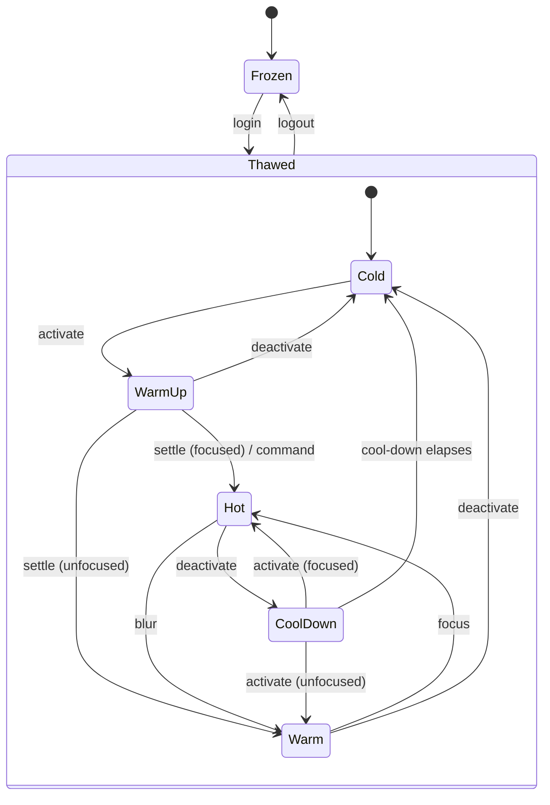
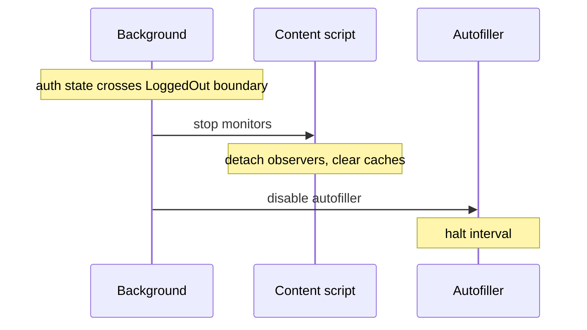
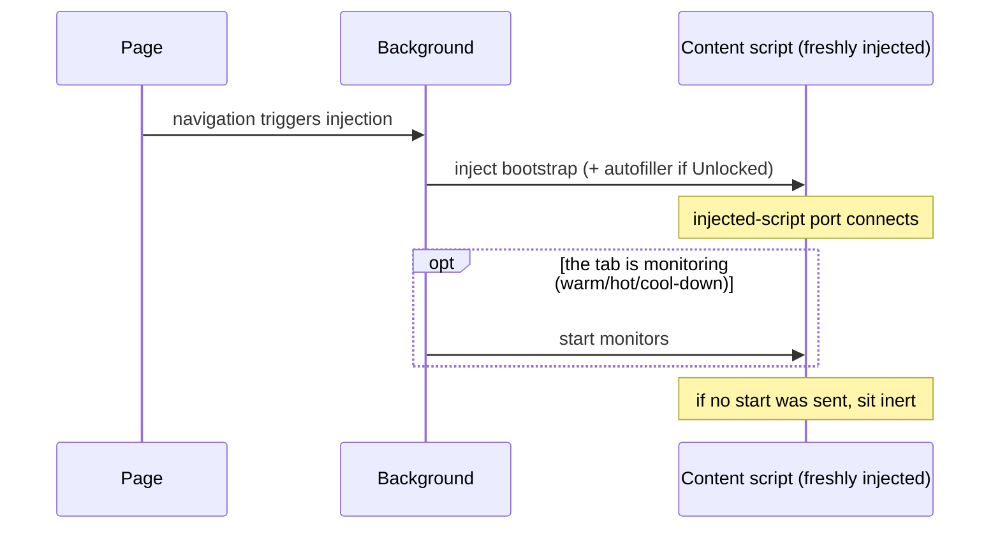

> [!NOTE]
> **Scope:** This document describes the desired state for web browser autofill.
> **Audience:** Engineers should align their decisions and code generators should align their implementation with the design described within this document.

# Autofill monitoring lifecycle

Bitwarden's autofill content scripts are injected into every page a user visits. They examine form fields, observe DOM mutations, position the inline menu, and surface notifications. That examination is valuable when the user has reason to want it, and inert work otherwise. The autofill monitoring lifecycle governs when monitors are running and signals when a lifecycle transitions.

## Background

Autofill runs inside an environment shaped by four lifecycles it observes but does not own:

- **The page lifecycle** — a page loads, then navigates. Within a single-page app a navigation swaps content without reloading the document, so a content script, once injected, persists across many navigations.
- **The account lifecycle** — an account logs in, locks and unlocks, and logs out. Examination is warranted only while an account is logged in: it should begin at login and stop at logout.
- **The extension lifecycle** — the extension process starts and stops. Firefox runs Manifest V2 with a persistent background page; Chrome runs Manifest V3, whose background is a service worker the browser terminates and restarts at will. In-memory background state is therefore durable on Firefox but ephemeral on Chrome, where it must be reconstructed on each restart.
- **The tab lifecycle** — a browser holds many open tabs, but the user views one at a time, switching among tabs and among windows. Each window has exactly one active tab; the rest sit behind it until the user returns to them.

These four are out of autofill's control; autofill must align its own behavior with them. The obstacle is that a content script, once injected, cannot be unloaded — only extension context loss, such as a navigation or page refresh, removes it. Refreshing is not an option, as it could lose the user's in-progress work, and navigation cannot be relied upon within single-page apps. So examination cannot be governed by injecting and unloading content scripts; it must be toggled in place as the lifecycles above demand.

## Architecture

Autofill's in-scope concern is the **monitoring lifecycle** — when autofill is actively engaged with a page. This work lives entirely in content scripts and is directed at the page: `AutofillMonitor` implementations examine fields and guard overlay integrity, and a separate page-transition monitor watches for loads and navigations.

The background `AutofillLifecycleService` owns this lifecycle. It starts and stops the content-script monitors as the account lifecycle crosses the logged-in boundary and as the user's active tab changes, and rebuilds them across the extension lifecycle when Manifest V3 restarts. The active-tab transitions it acts on are mediated by gates that impose deliberate entry and exit delays — a structural feature of the design, even as the specific delays remain tuned constants outside it. Page-transition reports flow to it, and it reconciles them against the account, extension, and tab lifecycles to decide what they warrant. It does not perform autofill itself: it emits a reconciled event, and the autofill machinery acts on it. The monitors stay simple: they examine and report.

Knowing which frames are live is one of the service's responsibilities. Every injected frame is a content script the service can address, and that knowledge is what protocol commands are sent to and what tells the service when a buffered transition can no longer be honored — when a frame is gone, a transition still waiting on it is dropped.

A content script's life has two scopes:

- _Monitoring_ is the active and reversible scope — it gathers indicators of fillable elements on the page and protects the integrity of autofill overlays. Its resources (observers, cached field maps, integrity-check timers) exist only while monitoring is in flight.
- _Disposal_ is the terminal scope — it removes injected DOM, nulls iframes, and tears down the rest of the graph.

These scopes are formalized by separate interfaces. The `AutofillMonitor` contract takes the reversible scope; `destroy()`, where present, takes the terminal one. Where both apply to a service, `destroy()` chains through `stopMonitoring()` first, so terminal cleanup always begins from a fully-detached state.

Monitoring may be entered and exited many times during a single content script's life, absorbing every on-demand toggle. Disposal happens exactly once, at the end, and is irreversible.

UI concerns are deliberately _outside_ the monitoring scope. They are part of the always-on UI plane, not the examination system. Their interaction with monitoring is one-directional: they read monitoring's caches when monitoring is in flight, and find empty state when it is not. Empty state is a valid outcome at every UI consumer; the absence of monitoring data is itself the gate that keeps the UI inert.

## The `AutofillMonitor` contract

```ts
interface AutofillMonitor {
  startMonitoring(): void;
  stopMonitoring(): void;
}
```

The contract describes what implementors must guarantee so that the controller above them can reason about lifecycle correctness without knowing the details of any particular monitor.

### Construction is inert

Constructors do no I/O and attach no listeners to globals. A freshly-constructed monitor produces no observable effects on the page; real work begins only when `startMonitoring()` is called.

Because construction has no side effects, the bootstrap constructs every monitor unconditionally, regardless of the auth state at injection time. A bootstrap injected into a logged-out tab sits in the page without examining anything until a signal arrives to begin.

### Monitoring is reversible and may repeat

`startMonitoring()` and `stopMonitoring()` may each be called many times across a content script's life. `startMonitoring()` begins examination against the page as it is at the moment of the call; `stopMonitoring()` detaches what was attached and discards what was cached.

Both methods are idempotent. A call to either is safe whether the monitor is currently running or not. Idempotency lets the controller call `stopMonitoring()` from any cleanup path — including disposal — without first checking state, and lets the protocol treat lifecycle commands as plain toggles rather than state-aware transitions.

### Monitoring-scoped state is cleared on stop

Any data a monitor caches in service of its examination — field maps, integrity-check state, fill-history bookkeeping — is monitoring-scoped. `stopMonitoring()` clears that state along with detaching observers. A future `startMonitoring()` begins with a clean view of the current page rather than reasoning against stale data left over from a prior session.

Clearing on stop is also what keeps the always-on UI safe while monitoring is stopped. UI handlers that consult monitoring data find empty state and gracefully no-op. There is no in-flight "monitoring is off" flag the UI has to consult; the cache being empty is the signal.

### The controller is the sole lifecycle caller

Monitors compose under a controller (the content-script services compose under `AutofillInit`). The controller is the only thing that calls `startMonitoring()` or `stopMonitoring()` on its sub-monitors. Sub-monitors do not call each other; external collaborators do not reach into them.

One owner of lifecycle calls means lifecycle reasoning is local to the controller. The controller decides which transitions are reachable and from where; sub-monitors do not need to coordinate.

### `destroy()` ≡ `stopMonitoring()` + disposal

Services that own both reversible and terminal work expose both methods. The identity holds: `destroy()` calls `stopMonitoring()` first, then performs disposal — UI removal, iframe nulling, terminal tombstones that mark the service unusable.

This composition keeps each scope focused. Anything reversible belongs to monitoring; anything that requires graph-wide teardown belongs to disposal. The two never entangle.

## The tab lifecycle

The browser reports the following facts about attention:

- which tab is active **in each window**, and
- which window is focused.

Autofill reads both, and they play different roles. **Monitoring** follows tab attention: a window's active tab is monitored whether or not that window is focused, so alt-tabbing between two windows won't flap monitoring state. **Filling** requires window attention too: a fill lands only on the active tab of the _focused_ window.

Autofill does not act on these raw facts directly. It maintains a state machine over them, using a _thermal_ model to represent monitoring levels. **Frozen** is a logged-out super-state: no tab monitors and no tab fills, whatever its activity. Login leaves it and logout returns to it from anywhere. The following states below all presuppose a logged-in account:

- **Cold** — a logged-in tab the user is not working in. Nothing monitors, and the tab holds none of the monitoring-scoped resources `stopMonitoring()` clears. If a page transition occurs in a cold state, it is buffered so that it can execute when the tab goes Hot.
- **Warm-up** — a just-activated tab, settling. It has become its window's active tab but has not yet been active long enough to settle, so it does not monitor. Window focus at the moment it settles picks where it lands.
- **Warm** — the active tab of an **unfocused** window. It monitors — the user may return to that window — but never fills, because the user is not looking at it.
- **Hot** — the active tab of the **focused** window. It monitors, and it is the only state that fills, so a fill lands where the user is actually looking.
- **Cool-down** — a tab that was hot and the user has just left. It keeps monitoring briefly, so a quick return finds monitoring already in flight, but it is no longer hot, so nothing fills there. When the cool-down elapses it falls back to cold and monitoring stands down.

Monitoring therefore runs while a tab is warm, hot, or cooling down, and only then; a cold or frozen tab is inert. Filling happens only while a tab is hot.



"Active" and "focused" are signals controlled by the browser. The states are virtual, owned by autofill and layered on top of them. The delays that make warm-up and cool-down stable and the churn they absorb belong to the protocol's [gating and delays](#gating-and-delays).

## The page lifecycle

A page-lifecycle monitor watches for the moments a page becomes ready to act on — its load, and the navigations that follow — and reports each as a transition. It does not examine field data and is **not** an `AutofillMonitor`. The autofiller (`apps/browser/src/autofill/content/autofiller.ts`) is the current monitor of this lifecycle. The browser surfaces no reliable signal for single-page-app navigation, so the autofiller synthesizes these transitions itself: it polls for URL changes and reports each as a `pageTransitionDetected` fact to the background. Like the tab lifecycle's thermal states, a page transition is a virtual state autofill maintains, not a fact the browser hands it.

Reporting is one-directional. The monitor states that a transition happened; it does not consult monitoring state, settings, or auth status, and it does not decide whether a fill should follow. Those are the background's decisions, made at a single evaluation point (see [Buffering transitions](#buffering-transitions)). This keeps the page-lifecycle monitor simple and lets new transition producers feed the same point without each re-deriving policy.

The autofiller's content-script lifecycle is asymmetric in the following respects:

- **Injection-gated start.** `autofiller.js` is added to the injection list only when `triggeringOnPageLoad && autoFillOnPageLoadIsEnabled`, and `autoFillOnPageLoadIsEnabled` can only be true when the user is unlocked. Locked or logged-out users get no fresh autofiller on a navigation; injection itself is the authorization gate.
- **Survives lock.** A running autofiller continues to poll for URL changes through `Unlocked → Locked`. The background ignores its transition reports while the vault is locked; on `Locked → Unlocked` it resumes reporting with no message exchange. Only logout disables a running monitor.
- **Message-driven disable on logout.** On the transition into `LoggedOut`, any running autofiller halts on receipt of `AutofillerCommand.disable`. The handler reuses the existing `handleExtensionDisconnect` cleanup — clearing the interval and any pending delay timeout — so disable and context-loss teardown share a single code path.
- **Terminal teardown on context loss.** On extension context loss the autofiller disposes permanently, via the `setupExtensionDisconnectAction` handler it already registers.

There is no `enableAutofiller` message. Re-enabling happens by re-injection on the next page-load when the user is unlocked. The autofiller's content-script lifecycle, in full: _inject (when unlocked) → report transitions → (disable on logout | dispose on context loss)_.

### Buffering transitions

Autofill can only fill a frame that is monitoring — monitoring is what makes the page details available to act on. A page-load fill therefore depends on monitoring, and the two are not ordered against each other: injection adds the autofiller, which begins reporting at page load, while the `start monitors` command follows separately. A transition can be reported before monitoring has started on a freshly-injected frame.

The background bridges that sequencing gap with a buffer that carries each reported transition through a small state machine, keyed on `(tab, frame)` so simultaneous navigations across many frames advance independently. Only the latest transition per frame is kept; a fresh transition replaces the one before it.

Reconciliation reads the reporting tab's lifecycle state (see [The tab lifecycle](#the-tab-lifecycle)). A reported transition is:

- **buffered** while its tab is cold, warming up, or cooling down. A transition reported on such a tab is effectively "paused", and may resume when the user next selects the tab. A buffered transition can outlive active monitoring.
- **resolved** when its tab reaches hot. Resolved transitions leave the buffer as an opportunity for autofill to act on (see [`autofill.design.md`](./autofill.design.md)). A transition reported while its tab is already hot resolves at once.
- **dropped** when its tab is warm, when the account logs out, or when the frame is lost. Warm is deliberately a drop, not a buffer: a background window's active tab is out of scope for a page-load fill. Transitions are always dropped when the user logs out in order to prevent one session from leaking to another.

> [!NOTE]
> **Buffering tracks the path to hot**, independent of monitoring state. Cold and warm are the instructive contrast: cold does not monitor but buffers (a _page loaded in the background_ waits for its first focus), while warm monitors but drops (_unfocused windows_ never fill).

A **command** — a user-initiated fill (keyboard shortcut, context menu, card/identity) targeting the tab — _consumes_ a buffered transition instead of resolving it. The command carries its own fill, so a page-load opportunity for the same tab would trigger a redundant second fill. The command drives the tab to hot early, which drops the pending transition rather than surfacing it.

### States are virtual

This state machine models browser interaction patterns. Its states do not represent real experiences. They are a way to reason about events significant to the autofill system. Autofill logic must not couple to discreet states. It should, instead, interpret state transitions.

> [!IMPORTANT]
> A transition is a momentary fact: it states what changed, and it stays true after the moment passes. A state field offers no such guarantee. A settling tab moves on with no signal to mark its arrival, so a stored state describes the past as readily as the present. Reporting both the state being left and the state being entered is what lets a consumer act on a change without keeping a state of its own.

A resolved transition leaves the service as a signal that this frame has reached a point where autofill _may_ act. Whether a fill actually happens is autofill's decision, governed by its own settings and policy (see [`autofill.design.md`](./autofill.design.md)), independent of the lifecycle. This is the reciprocal of one-directional reporting: producers report facts, the lifecycle reconciles them into an opportunity, and autofill decides what to make of it.

## The lifecycle protocol

Lifecycle messages flow one-way from the background to content scripts. Three commands compose the protocol:

- **start monitors** — content scripts begin or resume examination
- **stop monitors** — content scripts stand down examination
- **disable autofiller** — running autofillers halt their page-lifecycle reporting

The first two are paired and symmetric; the third is asymmetric. All three commands are idempotent at their receivers, so the broadcast layer can fan out without worrying about exact receiver state.

### Routing

Knowing which frames are live (above) is what makes routing possible: each injected bootstrap and autofiller is a content script the service can address, from injection until extension context loss. A lifecycle command fans out to every live `(tab, frame)`.

Frame liveness is in-memory background state, so it does not survive a Manifest V3 restart. On restart the background re-injects into every open tab, re-establishing both the connections it tracks and monitoring itself. That rebuild is on the critical path for the page-load fill: because a fill depends on monitoring, a transition reported after a restart cannot be honored until monitoring has been re-established for its frame.

A restart loses more than frame liveness. The gate timers and the monitoring state they compute are in-memory too, so a service worker terminated while a tab is cooling down comes back with no memory of which tabs were monitoring or counting down. Reconstruction is gated the same way steady-state monitoring is: the background re-establishes which tab is active in each window _before_ any reconnection-driven monitor start runs, so monitoring is rebuilt only on tabs the user is viewing. A cool-down lost to termination cannot leave a monitor stranded on a tab the user has left, nor can a reconnecting frame on such a tab resurrect monitoring the lost cool-down would have torn down.

### Gating and delays

Driving monitoring straight off the browser's raw active/inactive signal would churn: standing monitoring down discards the field maps and observer graph it built, and standing it back up rebuilds them from scratch. A user cycling through tabs with ctrl+tab, or flipping to a tab and straight back, would pay that teardown-and-rebuild cost on every flick. Two gates absorb the churn by delaying the state transitions the tab lifecycle triggers, and they are deliberately asymmetric.

- The **settle** delays _entry_: a newly-active tab begins monitoring only after it has stayed active for a short settling interval (warm-up). A tab merely passed through never settles, so ctrl+tab cycling triggers nothing. Window focus at the moment of the settle picks the destination — the focused window's active tab settles to hot, a background window's active tab to warm.
- The **cool-down** delays _exit_: a tab the user leaves keeps monitoring for a cool-down interval before it stands down. A flip-back inside that interval finds monitoring still in flight and rebuilds nothing.

The two are asymmetric — a tab inherits the settle delay on the way up and adds the cool-down delay on the way down — so monitoring starts decisively yet lingers cheaply. The settling and cool-down intervals are tuned constants, chosen to sit below the time of a deliberate return to a tab; their values are an operational tuning concern, not part of the design.

### Triggers

Monitoring commands follow a tab's monitoring state: a `start monitors` reaches a frame only when its tab is monitoring (warm, hot, or cooling down), and a `stop monitors` when its tab leaves those states. Login and a Manifest V3 restart are not distinct triggers — they are the machine driving each window's active tab up to warm or hot, which fires the same "tab enters monitoring" edge. Only the logout `disable autofiller` fans out to every frame.

| Trigger                                                                   | Target                                | Commands sent                                                       |
| ------------------------------------------------------------------------- | ------------------------------------- | ------------------------------------------------------------------- |
| Frame connects (freshly injected)                                         | One `(tab, frame)`                    | `start monitors` if its tab is already monitoring; otherwise none   |
| Tab enters monitoring (settles to warm or hot from cold)                  | Every connected `(tab, frame)` on it  | `start monitors`                                                    |
| Tab leaves monitoring (cool-down → cold, warm → cold, or logout → frozen) | Every monitoring `(tab, frame)` on it | `stop monitors`                                                     |
| Logout                                                                    | Every connected `(tab, frame)`        | `disable autofiller` (the `stop monitors` is the frozen edge above) |

The `Unlocked` boundary participates separately, but only at injection time: it gates whether a fresh navigation gets an autofiller. Transitions across `Unlocked` (lock and unlock events) emit no broadcast — monitoring rides tab state, which a lock does not change.

### Message sequences

#### Logging in (`LoggedOut → Locked` or `LoggedOut → Unlocked`)

```mermaid
sequenceDiagram
    participant BG as Background
    participant CS as Content script
    Note over BG: auth crosses LoggedOut boundary; each window's active tab thaws
    Note over BG: active tabs settle → warm/hot
    BG->>CS: start monitors
    Note over CS: attach observers, begin examining
```

Login thaws every tab out of frozen; each window's active tab then settles to warm or hot and its frames start monitoring, while the tabs the user is not viewing stay cold and inert. There is no blanket broadcast — the start reaches only the frames whose tab entered monitoring.

#### Logging out (any logged-in state → `LoggedOut`)



`disable autofiller` is sent to every live tab. Tabs that never had an autofiller (because the user was Locked at the time of their navigation) receive the message and no-op.

#### Locking the vault (`Unlocked → Locked`)

No broadcast. Monitors continue. A running autofiller continues its URL-change poll; the background ignores its transition reports until the vault is unlocked again. New navigations during the locked window get no autofiller (injection gate).

#### Unlocking the vault (`Locked → Unlocked`)

No broadcast. Monitors are already running. An autofiller surviving from a prior Unlocked window resumes reporting transitions with no message exchange. Tabs that navigated during the locked window pick up an autofiller on their next navigation, via the injection gate.

#### Switching to and from a tab (logged in)

```mermaid
sequenceDiagram
    participant U as User
    participant BG as Background
    participant CS as Content script
    U->>BG: switches to a tab (in the focused window)
    Note over BG: tab settles → hot
    BG->>CS: start monitors
    Note over CS: attach observers, begin examining
    U->>BG: switches away
    Note over BG: hot → cool-down; cool-down elapses → cold
    BG->>CS: stop monitors
    Note over CS: detach observers, clear caches
```

Sent only while an account is logged in; a logged-out tab never monitors regardless of which tab is active. Switching to a tab in the _focused_ window settles it to hot (it fills); a background window's active tab settles to warm (it monitors but never fills). A flip-back during cool-down finds monitoring still in flight and sends nothing.

#### New tab or frame on navigation



A page-level trigger script at `document_start, all_frames, *://*/*` wakes the service worker on every navigation regardless of auth state, so this flow runs on every new tab and frame — including for logged-out users, whose tabs end up with an inert bootstrap and no autofiller. A logged-in user's tab that is not the active tab is likewise left inert at injection; it begins monitoring only once it settles to warm or hot.

## Disposal

The graph-wide disposal path fires exactly once, on extension context loss. It runs `stopMonitoring()` first so disposal always begins from a known, fully-detached state. Then it removes the always-on listeners (the background-message listener and the context-menu listener), clears terminal scratchpads, and calls `destroy()` on each sub-service for the graph-wide cleanup of UI, iframes, and any other resources that have no place in monitoring's reversible scope.
