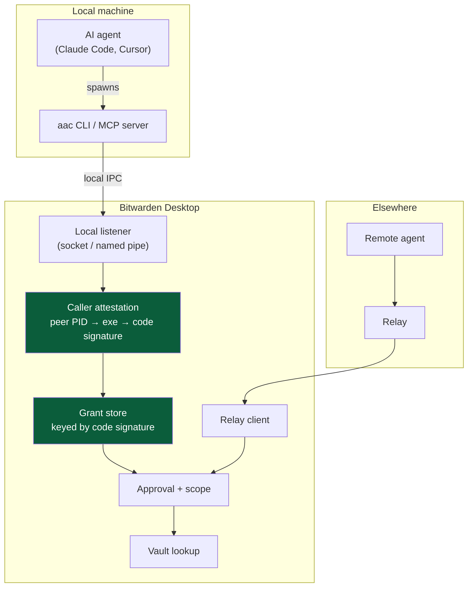

# Agent Access — Desktop Integration Plan

**Branch:** `feature/desktop-agent-access` · **Status:** pre-PR, not shipped · **Flag:** `FeatureFlag.DesktopAgentAccess` (`desktop-agent-access`)

This plan supersedes the pairing-based local flow currently on the branch. It keeps the Rust/napi
foundation, the activity log, and the remote pairing path largely intact, and replaces the local
authorization model.

---

## 1. Summary

Agent Access lets a paired agent request a single credential from the signed-in user's vault, with
per-request approval in the desktop app. The foundation is sound. Three things need to change before
this is shippable:

1. **Local agents get a local transport and OS-mediated authorization**, replacing token pairing.
   Today every local request round-trips through a third-party relay, and pairing cannot tell two
   local agents apart.
2. **Agents receive secret _references_, not secret values.** The current onboarding copy actively
   instructs agents to pull plaintext passwords into their context window.
3. **Approvals become reviewable and scoped** — the user sees which item matched (and picks, when
   several do), grants are bounded by scope and TTL, and requests are rate-limited.

Local and remote are two authorization models, not two configurations of one. Trying to serve both
with a single reusable token is what produced a flow that is simultaneously high-friction and
unsound.

---

## 2. Findings that drive this plan

### F1 — Local pairing does not distinguish agents (blocking)

`aac` stores one identity per user account:

```
~/.access-protocol/
├── connection_cache_remote_client.json
├── connection_cache_user_client.json
└── remote_client.key          ← one key. Per user. Not per agent.
```

Resolved in `crates/ap-cli/src/storage/identity_storage.rs:77` (`$HOME/.access-protocol/`). Every
invocation of `aac` on the account loads the same key and presents the same fingerprint. The desktop
side keys its connection store by fingerprint (`agent_access/src/client.rs:258` for name lookup,
`removeConnection(fingerprint)` for revocation).

Consequences, all currently true:

- Pairing a second local agent collides with the first rather than creating a new entry.
- Names in the Paired agents list are decoration — every local agent is one row.
- "Remove agent" revokes every local agent at once.
- The approval dialog's agent name reflects whichever label won, not who is asking.

The per-agent model — naming, listing, revoking, `peerName` in the activity log — does not function
locally. This is not a polish issue; the feature's core abstraction is inoperative in its primary
use case.

### F2 — The local pairing token is a remote-access credential (blocking)

`generatePskToken(name, reusable)` is always called with `reusable: true`
(`agent-access-pair-agent-dialog.component.ts:214`). Tokens have no expiry, no scope, and — per the
component's own documentation at line 33 — **no locality**: "This is _not_ a protocol switch — both
locations pair with the same reusable token."

So the local happy path generates a permanent, unscoped, internet-reachable vault-access credential
and instructs the user to paste it into an AI agent's context. Agent contexts leak by construction:
transcripts, provider-side retention, debug logs, `.claude/` files that get committed. A
prompt-injected agent can exfiltrate it directly.

An attacker holding that token pairs from anywhere via the relay. The approval dialog they trigger
displays the friendly name the _user_ assigned, so it reads as legitimate.

### F3 — Onboarding copy teaches agents to context-load passwords

`agentAccessAgentPromptLocal` / `agentAccessAgentPromptRemote` in
`apps/desktop/src/locales/en/messages.json` instruct the agent:

> `$CLI$ --domain <domain> --output json` … The JSON response contains `credential.username`,
> `credential.password` and `credential.totp`.

This is the one release mode with no available mitigation, and we generate the instructions for it.

### F4 — Match selection is arbitrary and unreviewable

`findCipher` (`desktop-agent-access.service.ts:317`) returns the first match:
`matches.find(isActiveLogin)` for domain, first substring hit for search. Three GitHub logins → the
agent silently receives one of them. The approval dialog shows a single item name with no picker and
no match count. A no-match denies with no dialog (`:193`), so the agent gets a generic denial and the
user sees nothing.

### What is already correct — preserve these

- `requester_name` is resolved from the connection store (`client.rs:258`), never self-reported by
  the requester. A requester-supplied name in an approval dialog is a spoofing primitive; keep this
  invariant.
- The credential response is built _before_ the dialog opens and the approved payload is the one
  shown (`desktop-agent-access.service.ts:200-217`). That closes the TOCTOU between "what was
  displayed" and "what was released." Do not regress it.
- Callback timeout denies by default (`CALLBACK_TIMEOUT`, `agent_access/src/client.rs:34`).
- Storage callbacks stay main-process-local; raw PSK/identity material never crosses IPC to the
  renderer (`main-agent-access.service.ts:222`).
- Activity events are metadata-only, never credential values.

---

## 3. Decision: split local and remote

|                 | **Local** (agent on this machine)            | **Remote** (server, CI, container)            |
| --------------- | -------------------------------------------- | --------------------------------------------- |
| Transport       | Unix domain socket / Windows named pipe      | Relay (WebSocket)                             |
| Peer identity   | OS peer credentials + code signature         | Cryptographic identity key                    |
| Enrollment      | **None** — first-use authorization prompt    | Pairing token, scoped and expiring            |
| Approval        | Per request, session-scoped grants allowed   | Per request; pre-authorization is future work |
| Secret delivery | Reference + inject-at-exec; browser autofill | Reference + inject-at-exec                    |
| Revocation      | Per attested binary                          | Per identity fingerprint                      |

Pairing is correct for remote — untrusted network, no shared OS, no peer credentials, out-of-band
token exchange is the only available mechanism. It is wrong for local, where the kernel authenticates
the peer for free and more strongly than a bearer token in a mode-600 file can.

---

## 4. Target architecture



The green nodes are new. Everything downstream of `AP` (approval, vault lookup, activity log) is
shared between both paths and already exists.

---

## 5. Workstreams

### W1 — Local transport

**Goal:** local agents never touch the relay.

**Changes**

- New module `apps/desktop/desktop_native/agent_access/src/local_listener.rs`. Model it on
  `core/src/ssh_agent/peercred_unix_listener_stream.rs` and `core/src/ssh_agent/unix.rs`, which
  already implement a peercred-carrying `UnixListener` stream.
- Socket path under the app's userData dir; Windows named pipe equivalent (see `ssh_agent` for the
  existing platform split).
- `DesktopAgentAccess::serve` (`agent_access/src/client.rs`) grows a second ingress. The relay client
  stays for remote; local requests enter through the new listener and converge on the same
  `CredentialRequestHandler`.
- SDK side: `aac` needs a local transport option. Today `ap-client` only offers `DefaultRelayClient`.

**Acceptance**

- A local `aac` request completes with the relay unreachable and the machine offline.
- No local credential traffic appears at the relay.

**Notes:** this also fixes latency and removes the dependency on a non-Bitwarden relay for the
dominant use case.

### W2 — Caller attestation and first-use authorization

**Goal:** replace local pairing entirely. Zero setup; identity comes from the OS.

**Changes**

- Reuse `core/src/ssh_agent/peerinfo/gather.rs` (`get_peer_info(pid)` — libproc on macOS, sysinfo
  fallback) to resolve the connecting PID to an executable path and process name.
- New: code-signature verification per platform. macOS — team ID / cdhash via `SecCodeCopySigningInformation`.
  Windows — Authenticode publisher. Linux — path only; document the weaker guarantee explicitly in
  the dialog copy.
- New grant store keyed on **code signature identity**, not on a key file. Lives alongside the
  existing keychain storage in `main-agent-access.service.ts` (service name `Bitwarden_agent_access`).
- New first-use dialog: _"Cursor (`/Applications/Cursor.app`, signed by Anysphere Inc.) wants to
  access your vault"_ + scope selection + Allow / Deny. This dialog **is** the pairing.
- Remove the local branch from `AgentAccessPairAgentDialogComponent`. The location radio collapses;
  that dialog becomes remote-only.

**Wrinkle — the connecting process is `aac`, not the agent.** Options, strongest first:

1. Make the local integration a long-lived **MCP server** the agent holds open. Stable peer, and it
   is where agent tooling is converging anyway. _Recommended._
2. Walk one level up the parent chain and attest the parent. Racy — a parent that exits reparents the
   child to init.
3. Attest the immediate caller only and display it plainly. This is what the SSH agent does
   (`ssh_agent/mod.rs:132` shows `process_name`, plus `is_forwarding` detection).

Whichever we pick, the dialog copy must not overclaim. Attestation is defense-in-depth, not a
boundary: same-user malware can inject into or ptrace a legitimate process absent hardened runtime,
or simply wait for the user to approve and scrape the result.

**Acceptance**

- Fresh install: `aac get --domain github.com` with no prior setup triggers the authorization prompt.
- Cursor and Claude Code appear as two distinct agents with independent scopes and revocation.
- Replacing the attested binary with an unsigned one at the same path triggers re-authorization.

### W3 — Secret handling: references, not values

**Goal:** the secret never enters the agent's context window.

The literal goal — a process using a value it cannot read — is unachievable. The achievable and
correct goal is that the _model_ never sees it. A value living 50 ms in a child process's environment
is acceptable; the same value in a transcript shipped to a provider is not, and is irreversible.

**Changes**

- `aac` returns an opaque handle (`bw://<grant-id>`), never a value, by default.
- New `aac run -- <command>`: resolves the reference, triggers approval, injects the value into the
  child's environment, and **scrubs the child's stdout/stderr**, replacing occurrences of the secret
  with `[redacted]`. The scrubbing is what makes this safe — it means an accidental `echo $TOKEN`
  does not land in context.
- Rewrite `agentAccessAgentPromptLocal` / `agentAccessAgentPromptRemote` to teach `aac run`. Remove
  all `--output json` / `credential.password` guidance.
- Drop raw-value return from v1, or gate it behind an explicit per-request "reveal" that is visibly
  higher-friction in the approval dialog.

**Release tiers** — classify by reversibility, and set approval friction accordingly:

| Mode                         | Exposure                 | Friction      |
| ---------------------------- | ------------------------ | ------------- |
| TOTP code                    | 30 s, single use         | lowest        |
| Injected at exec (`aac run`) | never in context         | normal        |
| Browser autofill (W3b)       | never leaves Bitwarden   | normal        |
| Raw value returned           | permanent, in transcript | highest / cut |

**W3b — browser autofill (phase 2, high value).** For "log into this site" — the dominant local use
case — route the credential to the Bitwarden browser extension and autofill it into the page the
agent is driving. The agent receives `{"loggedIn": true}`. Bitwarden owns both ends; the
desktop↔extension channel already exists for biometric unlock.

**W3c — short-lived derivatives (phase 3).** Where a service supports token exchange (GitHub
fine-grained tokens, cloud STS), mint an ephemeral scoped token rather than releasing the stored
long-lived one. Per-service work; worth it for the few that matter.

### W4 — Approval correctness

**Goal:** the user can tell what they are approving.

**Changes** — all in `desktop-agent-access.service.ts` and `approve-credential-request.component.*`:

- `findCipher` returns **all** matches, not `.find()`. Change the return type to `CipherView[]`.
- Approval dialog shows the match count and renders a picker when > 1. The selected cipher determines
  the response payload — keep building the payload before release, preserving the current TOCTOU
  property.
- No-match returns an actionable error to the agent instead of a silent deny, and writes an activity
  log line. Distinguish "no match" from "denied by user" in the protocol reply.
- Per-field release control. `notes` is currently always included and frequently contains unrelated
  secrets; make fields opt-in per grant, defaulting to username/password/TOTP only.

**Acceptance**

- Vault with three `github.com` logins → dialog lists three, user picks one, only that one is
  released.
- Query with no match → agent receives a distinguishable "not found", user sees an activity entry.

### W5 — Scope, TTL, and rate limiting

**Goal:** bound the blast radius before any request exists. This is the only real defense against
prompt injection, which caller attestation does nothing for — the agent is genuine, correctly signed,
and asking because a malicious README told it to.

**Changes**

- Scope selected at authorization time (local) or pairing time (remote): all logins / a specific
  collection or folder / an explicit item allowlist. Stored with the grant.
- Session-scoped grants: "allow for 5 minutes" ties to the session nonce and dies when the agent
  process exits. No cross-session "always allow."
- Per-agent rate limit and cooldown. A burst is the signature of an injection loop — escalate dialog
  friction on burst rather than letting approval fatigue do the attacker's work.
- Anomaly framing in the dialog: _"This agent has never requested this item before."_ More useful
  than a static warning nobody reads.

### W6 — Remote pairing hardening

**Goal:** keep pairing where it is correct, make it safe.

**Changes**

- Token expiry (default 15 min for enrollment), and a single-use option alongside reusable.
- Scope bound into the token at generation.
- `generatePskToken` signature grows scope + expiry; update `preload.ts`, `ipc-channels.ts`,
  `napi/src/agent_access.rs`, and the Rust `KvPskStore`.
- Resolve the fingerprint-verification inconsistency: `VerifyFingerprintDialogComponent` and its IPC
  pipeline are live, but pairing deliberately dropped the rendezvous ceremony, so a user can be shown
  _"compare this code with the one shown on the requesting agent"_ for a code they were never given.
  Either wire the ceremony into the remote flow or remove the dialog and its pipeline.
- Remove the dead relay step in the pair dialog: `showRelay()` is
  `!isLocal() && relayUrl !== AAC_DEFAULT_RELAY_URL`, and both constants are
  `"wss://ap.lesspassword.dev"`, so it is `false` by construction and never renders.

### W7 — UI and information architecture

**Changes**

- Onboarding on the Agent Access page: the model in three sentences, including "the app must be open
  and unlocked." Today `enableAgentAccessDesc` is the entire explanation and never says "AI."
- Move the setting out from under the SSH agent block in `settings.component.html`; rename toward
  what it does.
- Turning the setting on navigates to the Agent Access page rather than only revealing a nav item.
- Per-agent detail view: its activity, scope, rename, pause, revoke. Move the Activity tab under it;
  keep a global log as secondary.
- OS notification alongside `focusWindow()` for unlock-required requests, so a request on another
  Space is not lost to the 60 s timeout (`AGENT_ACCESS_UNLOCK_REQUEST_TIMEOUT`).

### W8 — Pre-merge blockers (carried forward)

- [ ] `FeatureFlag.DesktopAgentAccess` default is temporarily `true` for local testing — revert to
      `false` (`libs/common/src/enums/feature-flag.enum.ts`).
- [ ] `ap-client` and `ap-cli` are path deps on a local checkout at `~/Documents/development/agent-access`.
      Pin both to a git rev. **This blocks CI** — `desktop_native/build.js` reaches outside the repo to
      build the bundled binary, so no other machine can build it.
- [ ] Confirm Rust toolchain resolution in CI: `desktop_native` pins 1.96.0, agent-access pins 1.93,
      and `cargo --manifest-path` resolves the toolchain from the cwd, not the manifest.
- [ ] Mac App Store: `aac` sits in `Contents/MacOS` and is executed by external processes. Confirm MAS
      review/sandbox rules permit that before shipping the MAS target.
- [ ] **Snap and MAS: local socket is unreachable, feature silently no-ops.** Under snap strict
      confinement and the MAS sandbox, `os.homedir()` resolves to a redirected/sandboxed home (snap
      private home; MAS container `Data` dir) on the _desktop_ side, while the unconfined external
      `aac` process resolves the real user home — the two never agree on
      `~/.bitwarden-agent-access.sock`, and snap's AppArmor profile additionally blocks the real path
      outright. `aac` is currently shipped into both bundles as-is: it's listed in
      `apps/desktop/electron-builder.json`'s `mac.extraFiles` (inherited by the `mas` target, which has
      no override) and in `linux.extraFiles` (inherited by the `snap` target, one of `linux.target`).
      That means today it ships **non-functional** in both — no error, no dialog, requests just never
      arrive. Must be resolved (disable the feature on these targets, or give both sides a mutually
      reachable socket path — e.g. resolve the path the same way on both sides, or have the desktop app
      publish its redirected path somewhere `aac` can discover) before either target ships Agent
      Access. This is a build-config-visible symptom of a TS/architecture decision, not something
      fixable from `electron-builder.json`/`build.js` alone.
- [ ] Default relay `wss://ap.lesspassword.dev` is a non-Bitwarden dev relay. Must be Bitwarden-hosted
      before broad release.
- [ ] Upstream: ml-dsa rc.7→rc.9 may break persisted PQ identities. Protocol has no secret enumeration
      and free-form errors only.
- [ ] Notify `@bitwarden/team-key-management-dev` on the PR — crypto-adjacent.
- [ ] Unrelated pre-existing bug found along the way: `ssh-agent.service.ts:140` uses `map(() => EMPTY)`
      where `switchMap` is needed. Separate PR.

---

## 6. Sequencing

**Phase 1 — make it sound.** W1 + W2 + W3 (reference/inject only) + W4. This is the smallest set that
produces a defensible local feature. F1 and F2 are both resolved by W1+W2; F3 by W3; F4 by W4.

**Phase 2 — make it pleasant.** W5 + W7. Scope, TTL, rate limiting, and the IA rework that makes the
model legible.

**Phase 3 — make it valuable beyond the terminal.** W3b browser autofill, W6 remote hardening.

**Phase 4 — headless.** Deferred entirely; see below.

W1 and W3 are independent and can run in parallel. W2 depends on W1. W4 is independent of everything
and is the cheapest visible improvement — it can ship first if a demo is needed.

---

## 7. Open decisions

These need a human call before the affected workstream starts.

1. **MCP server vs. CLI subprocess for the local integration** (W2). Determines how strong caller
   attestation can be. Recommendation: MCP server.
2. **Does the remote path survive v1 at all?** It cannot serve headless/CI while every request needs a
   human click. Either cut "another machine" from v1, or label it explicitly as requiring a present
   human.
3. **Raw-value release: cut or gate?** (W3) Cutting is cleaner; gating preserves compatibility with
   whatever already consumes `--output json`.
4. **Relay ownership and timeline** (W8). Blocks broad release regardless of everything above.
5. **Linux attestation.** Path-only is materially weaker. Ship with a documented caveat, or hold the
   Linux local path?

---

## 8. Risks

- **Prompt injection is the dominant threat and attestation does not address it.** W5 scope limits are
  the actual mitigation. If W5 slips, the feature's blast radius stays unbounded.
- **Approval fatigue converts to reflexive approval.** Rate limiting and anomaly framing exist to slow
  this; monitor it in dogfooding.
- **Attestation overclaim.** If the dialog implies a guarantee stronger than "this binary was signed by
  X," we have moved risk rather than reduced it. Copy review required.
- **Two ingress paths converging on one handler** (W1) risks divergence in authorization checks. The
  convergence point must be the single place authorization is enforced.
- **SDK coupling.** W1 and W3 both require changes in `bitwarden/agent-access`. Sequence the SDK work
  first or both stall.

---

## 9. Out of scope

- **Headless / CI (pre-authorized, no human present).** Needs a fundamentally different authorization
  model — scoped grants issued ahead of time, likely with a separate audit and revocation story.
  Shipping the current "another machine" path without it means shipping a flow that dead-ends after
  60 seconds.
- **Secrets Manager via user auth.** Crypto/API-wise straightforward (org key + user bearer token),
  but SM client code is Bitwarden-Licensed and desktop has no `bit-desktop` overlay. Needs a
  product/licensing decision.
- **Non-Login cipher types** (SSH keys, cards, secure notes, custom fields).
