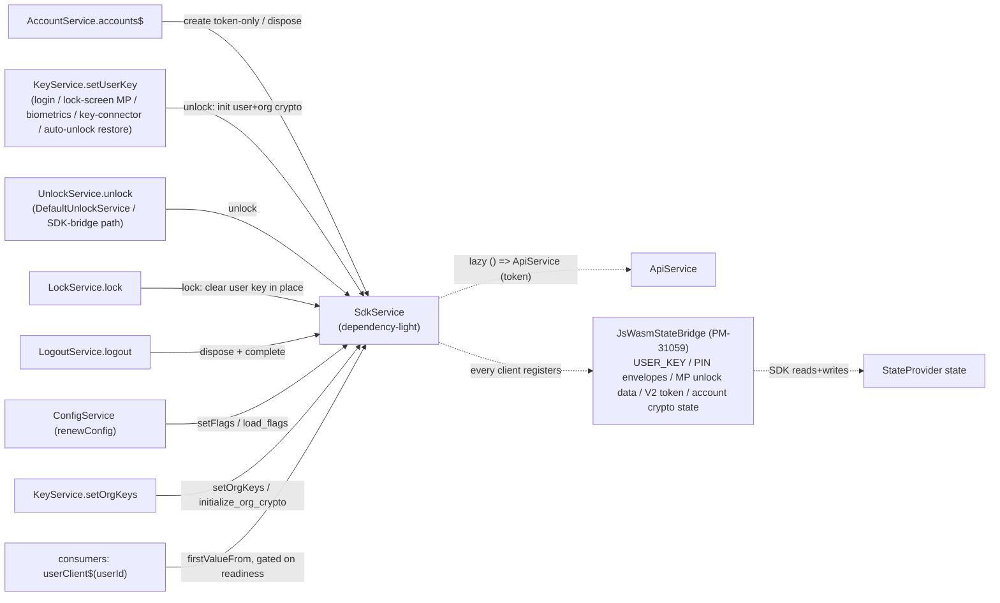
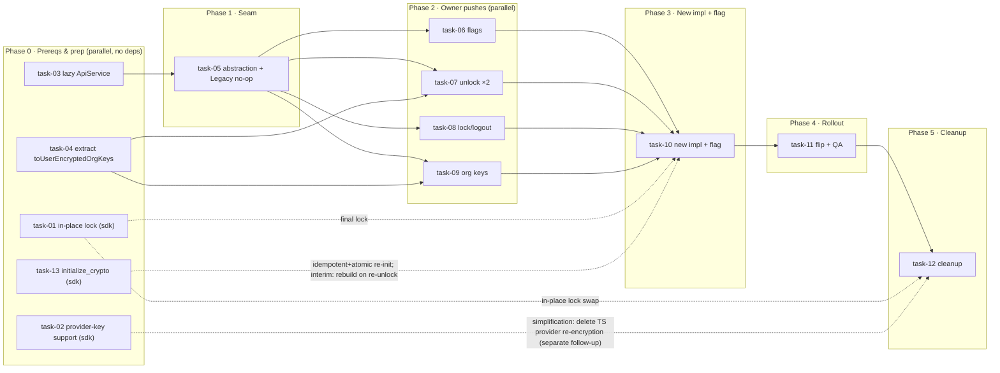

# Tech Breakdown: Extend SDK Client Lifetime to the Authenticated User Session

## Status

- **Status:** In Progress (PoC built; cross-team signoffs still pending — see the table below)
- **Last substantive update:** N/A
- **Active owner / contact:** Dani Garcia (@dani-garcia)
- **Jira:** [PM-31845](https://bitwarden.atlassian.net/browse/PM-31845) · epic [PM-31844](https://bitwarden.atlassian.net/browse/PM-31844) · parent [BW-149](https://bitwarden.atlassian.net/browse/BW-149) · label `platform-initiative`

---

# Specification

## Description

The per-user Bitwarden SDK client (`PasswordManagerClient`, WASM) is rebuilt far more often than the
user session needs. `DefaultSdkService.internalClient$` re-creates and re-initializes the client on
every change to its inputs (env, account, KDF, account crypto state, user key, org keys) and tears it
down 1s after the last subscriber unsubscribes.

This work makes the per-user client **long-lived**: created when a user logs in / unlocks, mutated in
place, disposed only on logout. Beyond the lifetime change, it **inverts the data flow** — `SdkService`
becomes a dependency-light holder of clients, and the services that own each piece of state push it in:

- **`AccountService.accounts$`** drives client _existence_ (create token-only client on appear, dispose on logout).
- **`UnlockService`/`LockService`** drive _crypto_ state (unlock/lock).
- **`ConfigService`/`KeyService`** push _flags_ / _org keys_.

Scope: all clients consuming the WASM SDK via `DefaultSdkService` (web, browser, desktop, CLI).
Client-side only; no server, DB, or API changes; zero-knowledge invariant unchanged.

## User Value

- **Eliminates per-operation churn** — operations in quick succession no longer each rebuild the client
  and re-run `initialize_user_crypto`/`initialize_org_crypto`/`load_flags`.
- **Unblocks durable SDK state** — a session-scoped client is the prerequisite for migrating more
  password-management logic into the SDK (BW-149).
- **Removes a long-standing coupling smell** — `SdkService` no longer depends on `ConfigService`/
  `KeyService`/`KdfConfigService` (the `no-restricted-imports` circular-dependency disable is gone).

## Functional Requirements

- One long-lived client per unlocked session; reused across all consumers and operations; not rebuilt
  on incidental input changes or on subscription ref-count reaching zero.
- State changes applied to the existing client: flags via `load_flags`; user key (unlock / re-unlock /
  rotation) via the idempotent, atomic `initialize_crypto` (user + org crypto in one call — re-runnable
  on an already-unlocked client); org keys via `initialize_org_crypto`.
- **Owners push to the SDK _before_ emitting the corresponding state observable** (push-then-emit). The
  awaited push must complete before the state write that a consumer-facing observable reflects, so a
  reactive consumer combining e.g. `userKey$` with `userClient$` never sees new state paired with a client
  the SDK has not yet updated. For `setUserKey` this means building the SDK payload from the **in-memory**
  user key (not re-reading `USER_KEY` from state), pushing, then writing `USER_KEY`. This ordering gates
  the rollout flip.
- `userClient$` never falsely errors during the client-creation window (readiness gating on
  `accounts$`); it completes on logout and errors with `UserNotLoggedInError` only when not logged in.
- Lock clears the in-memory user key in place (`client.unlock().lock()`, same client instance retained;
  interim pre-Task-1: a key-cleared token-only rebuild); logout disposes and completes.

## Alternatives

- **Narrow the rebuild triggers / drop the 1s teardown only** — reduces churn but keeps the disposable
  client; doesn't unblock durable SDK state. Rejected as the primary solution.
- **Keep `SdkService` reactive (subscribe to `ConfigService`/`KeyService`)** instead of push — cycle-free,
  but keeps the heavy deps and the reactive churn inside `SdkService`, and has a subtler correctness
  problem: **no happens-before between an owner's state and `userClient$`**. A consumer that combines them,
  e.g. `combineLatest([keyService.userKey$, sdkService.userClient$(userId)]).pipe(map(...))`, can observe a
  new user key paired with a client the SDK has not re-initialized with that key yet — the two streams
  propagate independently, so there is no guarantee the client is updated by the time the new key emits.
  Push _can_ close this, but only with the right ordering: the owner must update the SDK **before** writing
  the state the observable reflects (push-then-emit — see Functional Requirements). Reactive cannot be fixed
  this way: two independent streams have no happens-before to order them, period. Rejected in favor of push,
  which also enables the dependency-light end state.

## Success Criteria

- After unlock, N operations → exactly one `createSdkClient` call (verified in the PoC spec).
- Server-config change re-applies flags to the existing client (no rebuild); key rotation re-inits in
  place (no rebuild); lock clears the user key in place (same client retained); logout completes `userClient$`.
- All existing `userClient$` consumers (~12 services / ~39 sites) work unchanged.
- Push-then-emit holds: a reactive consumer combining `userKey$` (or `encryptedOrgKeys$`) with `userClient$`
  observes the SDK already updated — the push precedes the state write (`setUserKey` / `setOrgKeys`).
- No DI cycle; full workspace type-check green.

---

# Plan

## Current State (before this work)

`DefaultSdkService.internalClient$` (`default-sdk.service.ts:166-249`) rebuilds via `combineLatest →
switchMap` and self-destructs (`resetOnRefCountZero: timer(1000)`), with a disposal-race `filter`
(134-142) as a symptom. `SdkService` depended on `ConfigService`, `KeyService`, `KdfConfigService`,
`AccountCryptographicStateService` (+ the eslint-disabled circular import). `setClient` was dormant.

## Architecture (as built)



- `SdkService` deps (end state, post-cleanup): `sdkClientFactory`, `environmentService`, `platformUtilsService`,
  `accountService`, **`() => ApiService`** (lazy), `stateProvider`. The lazy token provider is the cycle break.
  During rollout the constructor additionally carries the four lazy legacy-path deps (`() => KdfConfigService`,
  `() => KeyService`, `() => AccountCryptographicStateService`, `() => ConfigService`) for the reactive
  `internalClient$` branch; these are removed at cleanup (task-12).
- Existence follows `accounts$` (idempotent `ensureClient`); `userClient$` gates on `accounts$` for
  readiness; lifecycle + data are **pushed** by the owners via direct awaited calls.
- **Every client (token-only _and_ unlocked) registers a `JsWasmStateBridge`** via
  `km_state_bridge().register_bridge_impl(...)` (carried over from PM-31059). It is the SDK's read/write
  window into key-management state. Required not only for SDK-managed PIN unlock but for **lock-screen PIN
  reads on the locked token-only client** (`validate_pin`, `get_status`, `get_lock_type`) and for PIN
  enrollment / account-crypto-state regeneration on the unlocked client.
- `Rc` retained (consumer `.take()` contract + safe disposal on lock/logout). The rebuild observable,
  the 1s teardown, the disposal-race filter, and `setClient` have no equivalent in this path — during
  rollout they live on in the same class's legacy `internalClient$` branch, removed at cleanup (task-12).

This diagram is the **long-lived path**. During rollout `DefaultSdkService` also keeps the reactive
`internalClient$` branch; `userClient$` / the push methods / the `accounts$` subscription pick a path
from `FeatureFlag.PM31845_LongLivedSdkClient` (captured once at startup). See the Tasks section.

## Data model / Server / API changes

None.

## `sdk-internal` changes

**One prerequisite addition (Task 1): expose the existing `UnlockClient` through WASM + add an in-place
`lock()`.** A `bitwarden_unlock::UnlockClient` and `PasswordManagerClient::unlock()` already exist
natively, but only for the CLI (session-key methods, all `#[cfg(feature = "cli")]`) — nothing is
`#[wasm_bindgen]`, the WASM `PasswordManagerClient` has no `unlock()` accessor, and there is no
in-memory `lock()`. Task 1 WASM-exposes the accessor and adds an ungated `lock()` so the call is
`client.unlock().lock()`. `lock()` clears the in-memory user + org keys without `free()`-ing the client,
letting the per-user client stay a single long-lived instance across lock → unlock instead of the interim
approach of disposing the unlocked client and rebuilding a token-only one on every lock. The zeroization
guarantee is already met by the key store: `KeyStore::clear()` drops `ZeroizeOnDrop` key values, matching
what `free()` gives today by releasing the client's WASM memory — so no new zeroization code is needed.
Not a hard blocker: the client-side lock ships as an interim dispose + rebuild (task-10) and is swapped to
the in-place `client.unlock().lock()` only at cleanup (task-12) once this lands.

**Second prerequisite addition (task-13): an idempotent, atomic `crypto().initialize_crypto(userReq, orgReq)`.**
The long-lived client re-runs unlock on the _same_ instance, but `initialize_user_crypto` is **not
re-callable**: it errors `CryptoInitialization` if the keystore already holds user / private / signing
keys (the guard in `internal.rs`), so a second init on an already-unlocked client fails. That re-unlock is
**not hypothetical** — it happens in normal use, which is why this method is required, not optional:

- The two unlock writers are **not disjoint** on every path. A desktop lock-screen master-password unlock
  fires **both** `DefaultUnlockService` (PM-31059's SDK-bridge unlock) **and** `keyService.setUserKey`
  (the lock component sets the key in state afterward) — two unlock pushes into the live client for one
  unlock. (Observed in testing; see task-07.)
- `KeyService.refreshAdditionalKeys()` re-calls `setUserKey` with the _same_ key (vault-timeout settings change).
- Key rotation re-unlocks with a _new_ key.

`initialize_crypto` (WASM-only) clears the keystore, then initializes user + org crypto in one call —
so it is **idempotent** (safe to re-run: first unlock, re-unlock, the writer overlap, rotation) and
**atomic** (user + org set together, closing the window where `initialize_user_crypto` clears org keys
before a separate `initialize_org_crypto` re-adds them — a window observable to a consumer or another push
landing in between). It reuses the existing init flow (`should_copy_user_key`, V2 upgrade,
account-crypto-state) behind a `get_key_store().clear()`, so **no new crypto**. The long-lived unlock calls
this single method; standalone `initialize_org_crypto` stays for `setOrgKeys` (org-key changes without a
re-unlock). Until it lands, the interim is a client-side dispose + rebuild of the token-only client on
re-unlock.

The rest the design needs already exists: `crypto().initialize_org_crypto`, `platform().load_flags`,
`free()`. (`initialize_user_crypto` is kept for the reactive flag-off path, which inits each client once.)

## Client services changes

- **`SdkService`** — dependency-light; `accounts$`-driven existence; readiness-gated `userClient$`;
  push API `unlock`/`lock`/`logout`/`setFlags`/`setOrgKeys`; lazy `() => ApiService`. `buildTokenOnlyClient`
  registers the `JsWasmStateBridge` (PM-31059) on every client so SDK-managed PIN unlock and lock-screen
  PIN reads work on the long-lived (incl. locked) client. `unlock()` uses `decryptedKey` (key inline);
  with the push-then-emit reorder the SDK's `decryptedKey` copy-back is the first `USER_KEY` write (SDK as
  source of truth), so the explicit write is dropped at cleanup (task-12).
- **`KeyService.setUserKey`** — the canonical "user key in memory" point (login strategies, lock-screen
  master-password, biometrics, key-connector, **auto-unlock restore**). Builds the SDK payload from the
  **in-memory** key (`buildSdkUnlockData` derives `userPrivateKey` via `decryptPrivateKey`, **no `USER_KEY`
  read-back**), `await`s `sdkService.unlock(...)`, **then** writes `USER_KEY` (push-then-emit).
  `buildSdkUnlockData` (public, shared) returns `null` if email/KDF/crypto-state isn't ready.
- **`UnlockService`** — `DefaultUnlockService` uses the SDK state-bridge (doesn't call `setUserKey`), so
  it pushes the unlock itself, delegating the payload to `keyService.buildSdkUnlockData`.
- **`LockService.lock`** — `await sdkService.lock(userId)` **before** wiping decrypted state (push-then-emit;
  reverses the prior order — see task-08). In-place `client.unlock().lock()` once Task 1
  lands; interim: dispose unlocked client + token-only rebuild.
- **`LogoutService.logout`** (+ `ExtensionLogoutService`) — `sdkService.logout(userId)` (dispose before broadcasting logout).
- **`ConfigService.renewConfig`** — `await sdkService.setFlags(userId, flags)` **before** persisting `USER_SERVER_CONFIG` (push-then-emit).
- **`KeyService.setOrgKeys`** — computes the payload from the value being written (no `firstValueFrom`
  re-read) via the shared `toUserEncryptedOrgKeys` (handles provider keys) and `await`s
  `sdkService.setOrgKeys(...)` **before** writing `USER_ENCRYPTED_ORGANIZATION_KEYS` (push-then-emit).
- **DI/construction** — the jslib `SdkService` provider is a `useFactory` resolving its `ApiService` plus all
  four legacy-path deps (`KdfConfigService` / `KeyService` / `AccountCryptographicStateService` /
  `ConfigService`) lazily via `Injector`. Owners inject `SdkService` **eagerly** (normal
  injection, not a `() => SdkService` thunk), so in the manual-DI apps (cli/browser) `SdkService` must be
  **constructed before** the owners that push into it (`KeyService`, `ConfigService`, lock/logout). Each
  owner-push task that adds the dep restates this reorder. _Considered:_ the lazy-thunk alternative
  (`() => injector.get(SdkService)`, the codebase's cycle-break idiom) would avoid the reorder entirely;
  we keep eager injection for readable owner constructors and accept the one-time manual-DI reorder.
  New constructor params are **appended last** unless a task says otherwise. `ExtensionLockService`,
  `ExtensionLogoutService`, `ElectronKeyService`, and the popup `KeyService` factory are updated for the
  new param.

## Security & cryptography

No new crypto. The lock invariant (clear the in-memory key) is preserved by the prerequisite in-place
`client.unlock().lock()`, which securely zeroizes the user + org keys on the live client, plus the existing
process reload as defense in depth. Until that lands, the interim path disposes the unlocked client
(`free()` releases its WASM memory, clearing the key) and rebuilds a token-only one — also secure. Key
material lives in memory for the unlocked session (as it effectively did between rebuilds); cleared on
lock. No SecOps review required.

## Deployment & environments

Cloud + self-hosted identical (client-side). Rollout is **flag-gated** (see Tasks): `DefaultSdkService`
holds both the legacy reactive path and the long-lived push path, branching on the rollout flag
`FeatureFlag.PM31845_LongLivedSdkClient` (`"pm-31845-long-lived-sdk-client"`, in
`libs/common/src/enums/feature-flag.enum.ts`). Because `SdkService` is a singleton holding every user's
client, the flag is **captured once at startup** (per-install / per-version targeting) and reused — no
live updates; the path can't be swapped under a live session. Owner-push code lands behind the flag as
no-ops while off, so it's dark until the flip; the kill switch is the flag. Cleanup removes the legacy
branch + the flag once the rollout sticks.

## Testing strategy

- Unit (present, green): create-once/reuse, in-place flag + key-rotation, no teardown on unsubscribe,
  lock disposal + key-cleared client (interim; becomes "lock clears the key in place, same client
  instance retained" once Task 1 lands), logout completion, not-logged-in error.
- Integration: login → unlock → lock → unlock → logout; multi-account isolation; live flag/org-key push;
  browser SW-eviction rebuild.
- Push-then-emit ordering (new in task-07/09): assert `sdkService.unlock` / `setOrgKeys` is awaited
  **before** the corresponding state write, and that `buildSdkUnlockData` reads no `USER_KEY` from state.
- Full workspace type-check (green) is the guard against a reintroduced DI cycle; an app boot is the
  definitive runtime cycle check.

## Technical debt

Removed **at cleanup (task-12)** once the rollout sticks: the
disposal-race `filter`, the 1s teardown, the `internalClient$` reactive branch, the dormant `setClient`,
the flag + its branches, and the lazy-dep shims + circular-dep eslint-disable. (They live on in
`DefaultSdkService`'s legacy branch until then.) Follow-ups: replace the interim dispose+rebuild lock with
the in-place `client.unlock().lock()` once task-01 lands. The redundant `unlock` re-init on a
vault-timeout-settings change (`refreshAdditionalKeys` re-calls `setUserKey` with the same key) is now
**safe** — `initialize_crypto` (task-13) is idempotent — but still clears + re-inits; a
no-op-when-the-key-is-unchanged optimization in the SDK could skip it.

---

# Cross-team engagement

Touches Platform (`SdkService`, `ConfigService`, DI), Key Management (`KeyService`, the
`JsWasmStateBridge` / SDK-managed PIN unlock from PM-31059), and Auth
(`UnlockService`/`LockService`/`LogoutService`) in the clients repo, plus **`sdk-internal` prerequisites**
owned by Key Management — the in-place `client.unlock().lock()` (task-01) and the idempotent + atomic
`crypto().initialize_crypto` (task-13). Those teams should sign off on the constructor/wiring changes in
their services. **PM-31059 (SDK-managed PIN unlock, KM)
overlaps directly** — it landed the state bridge and the register/long-lived client split; coordinate the
`decryptedKey`-vs-`clientManagedState` and V2-upgrade questions with its author.

| Team           | Interface                                                                                                                    | Blocking?                                                                           | Signoff |
| -------------- | ---------------------------------------------------------------------------------------------------------------------------- | ----------------------------------------------------------------------------------- | ------- |
| Key Management | WASM-expose `UnlockClient` + add in-place `lock()` (`client.unlock().lock()`)                                                | soft — task-01; interim (dispose + rebuild) ships without it, swapped in at cleanup | ☐       |
| Key Management | idempotent + atomic `crypto().initialize_crypto(user, org)` (clears, then sets user + org; re-callable)                      | soft — task-13; interim (rebuild on re-unlock) ships without it                     | ☐       |
| Key Management | provider-encrypted org-key support in `initialize_org_crypto` (simplification: lets us delete the TS provider re-encryption) | future (not blocking)                                                               | ☐       |
| Platform       | `SdkService` rework + `ConfigService` push + DI                                                                              | n/a (owning)                                                                        | ☐       |
| Key Management | `KeyService` constructor + `setOrgKeys` push; state-bridge / PIN-unlock interaction (PM-31059)                               | review                                                                              | ☐       |
| Auth           | `UnlockService`/`LockService`/`LogoutService` push                                                                           | review                                                                              | ☐       |

---

# Tasks

> **Landing strategy: flag-gated single class.** `DefaultSdkService` temporarily holds **both** paths —
> the existing reactive `internalClient$` and the new long-lived push machinery — and branches on
> `FeatureFlag.PM31845_LongLivedSdkClient` (captured once at startup) inside `userClient$`, the push
> methods, and the `accounts$` subscription. No second class, no selector. Every task below **compiles
> and leaves the app working on the default flag-off path** — the push methods are no-ops while off, so
> they land independently; the long-lived path only runs when the flag is on, by which point all pushes
> exist. Cleanup (task-12) deletes the legacy branch + the flag.
>
> Why the lazy deps: on `main`, `SdkService` constructs with `ConfigService`/`KeyService`/`KdfConfigService`/
> `AccountCryptographicStateService` deps (for `internalClient$`). Any owner injecting `SdkService` to
> push into it closes a 2-node construction cycle (`KeyService ↔ SdkService`, `ConfigService ↔ SdkService`)
> that manual DI cannot build. All four legacy-path deps are therefore resolved lazily (`() => KeyService`,
> `() => ConfigService`, `() => KdfConfigService`, `() => AccountCryptographicStateService`; task-05):
> `KeyService`/`ConfigService` to break the cycle, `KdfConfigService` because `SdkService` is now
> constructed _before_ it in manual DI (forward reference), and `AccountCryptographicStateService` for
> uniformity (built before `SdkService` in cli/browser, so it neither cycles nor is forward-referenced, but
> kept lazy alongside the others). They're touched only when the reactive `internalClient$` is subscribed.

**Tasks within a phase can be done in parallel**; a phase generally needs the previous one done first
(exceptions noted). Every clients-repo task compiles and leaves the app working on the default flag-off path.

### Dependency graph



### Breakdown by phase

Each task compiles and leaves the app working on the default flag-off path.

#### Phase 0 — Prerequisites & prep

No dependencies; everything here can start immediately, across two independent tracks.

**SDK track** (`sdk-internal`, Key Management — external; only the final lock swap and the TS re-encryption deletion wait on these):

- **task-01 — in-place `unlock().lock()`.** WASM-expose the existing (native, CLI-only) `UnlockClient` +
  `PasswordManagerClient::unlock()`, and add an ungated `lock()` that clears the in-memory user + org keys
  via `KeyStore::clear()` (zeroizes through `ZeroizeOnDrop` — no new crypto). Lets the client stay one
  long-lived instance across lock → unlock (`client.unlock().lock()`) instead of dispose + rebuild.
- **task-13 — idempotent + atomic `initialize_crypto`.** Add `crypto().initialize_crypto(userReq, orgReq)`
  (WASM-only): clear the keystore, then init user + org crypto in one call. `initialize_user_crypto` is
  **not** re-callable (it errors if the client already holds keys), but the long-lived client re-unlocks
  in normal use (two unlock writers fire for one unlock; `refreshAdditionalKeys`; rotation), so the unlock
  primitive must be idempotent — and atomic, so there's no window between user and org init. Interim until
  it lands: dispose + rebuild the token-only client on re-unlock.
- **task-02 — provider-key support.** Teach `initialize_org_crypto` to accept provider-encrypted org keys
  directly. A **non-blocking** simplification — it later lets the clients delete the TS
  `toUserEncryptedOrgKeys` re-encryption; not a prerequisite for anything.

**Clients track** (`clients`, Platform — lands on `main`):

- **task-03 — lazy `() => ApiService`.** `SdkService` needs `ApiService` only for the token provider;
  resolving it lazily breaks the runtime DI cycle
  `SdkService → ApiService → VaultTimeoutSettingsService → KeyService → SdkService`. Behavior-neutral.

  ```ts
  // jslib provider: resolve ApiService lazily instead of injecting it
  useFactory: (injector: Injector, /* … */) =>
    new DefaultSdkService(/* … */, () => injector.get(ApiServiceAbstraction), /* … */),
  ```

- **task-04 — extract `toUserEncryptedOrgKeys`.** Pull the "stored encrypted org keys → user-encrypted org
  keys the SDK accepts" transform out of `encryptedOrgKeys$` into a private
  `toUserEncryptedOrgKeys(encOrgKeys, userPrivateKey, providerKeys)` helper, so the unlock (task-07) and
  org-keys (task-09) pushes can reuse it. Pure refactor.

#### Phase 1 — Seam (depends on task-03)

- **task-05 — abstraction + no-op pushes + lazy deps.** Add the push API to the `SdkService` abstraction
  (`unlock` / `lock` / `logout` / `setFlags` / `setOrgKeys`), implemented as **no-ops** on
  `DefaultSdkService`. Lazy-resolve its `KeyService` / `ConfigService` deps (`() => KeyService`,
  `() => ConfigService`) so owners can inject `SdkService` without closing a construction cycle.
  Behavior-neutral — the reactive `internalClient$` still drives everything — and it unblocks every
  owner-push task.

#### Phase 2 — Owner pushes (parallel; all depend on task-05)

Each pushes its state into the live client **before** writing the state its observable reflects
(push-then-emit), and is a no-op while the flag is off.

- **task-06 — flags push** (Platform). `ConfigService.renewConfig` pushes the resolved boolean flags, then
  persists the config:

  ```ts
  await this.sdkService.setFlags(userId, toSdkFeatureFlags(newConfig));
  await this.stateProvider.setUserState(USER_SERVER_CONFIG, newConfig, userId);
  ```

- **task-07 — unlock push, both `USER_KEY` writers** (Key Management + Auth; also depends on task-04).
  `USER_KEY` has two writers — hook both: `KeyService.setUserKey` (login, lock-screen MP, biometrics,
  key-connector, auto-unlock restore — this is what makes browser MV3 eviction recover) and
  `DefaultUnlockService` (the SDK-bridge path). Both share `buildSdkUnlockData`, which builds the payload
  from the **in-memory** key (no `USER_KEY` read-back), so the push lands before the state write:

  ```ts
  // setUserKey: push before writing USER_KEY (org keys derived from the in-memory key)
  const unlockData = await this.buildSdkUnlockData(userId, key);
  if (unlockData != null) await this.sdkService.unlock(userId, unlockData);
  await this.stateProvider.setUserState(USER_KEY, this.userKeyToStateObject(key), userId);
  ```

  Open: the bridge path writes `USER_KEY` via the register client before the long-lived push — its
  ordering needs PM-31059 coordination.

- **task-08 — lock / logout push** (Auth). `LockService.lock` clears the live client's in-memory key
  (`sdkService.lock`) **before** clearing `USER_KEY` (reverses the prior order); `LogoutService.logout`
  (+ `ExtensionLogoutService`) disposes the client (`sdkService.logout`) before broadcasting logout. Open:
  confirm with SDK / PM-31059 that a key-cleared client ignores stale `USER_KEY` in the clear window, else
  make `lock()` atomic.

- **task-09 — org-keys push** (Key Management; also depends on task-04). `KeyService.setOrgKeys` builds the
  SDK payload from the value it's about to write (via `toUserEncryptedOrgKeys`) and pushes
  `sdkService.setOrgKeys` before the `USER_ENCRYPTED_ORGANIZATION_KEYS` state write. No-op while locked.

#### Phase 3 — New behavior + rollout flag (depends on task-05…09; soft-depends on task-01, task-13)

- **task-10 — long-lived machinery + flag branch.** Add the long-lived push machinery into
  `DefaultSdkService` alongside the reactive path, branching on `FeatureFlag.PM31845_LongLivedSdkClient`
  (captured once at startup) in `userClient$`, the push methods, and the `accounts$` subscription.
  Flag-off keeps the reactive `internalClient$`; flag-on runs the long-lived path — by which point every
  owner push exists. The long-lived `unlock()` calls the idempotent + atomic `initialize_crypto` (task-13)
  so re-unlocks don't double-init; until that lands, the interim is a dispose + rebuild on re-unlock.

#### Phase 4 — Rollout (depends on task-10)

- **task-11 — flip flag + QA.** Enable the flag in a staged rollout and verify the full lifecycle on every
  client: login / lock / unlock / logout, PIN & biometric unlock, key rotation, browser MV3 eviction
  recovery, live flag/org-key pushes, and push-then-emit ordering. The flag is the kill switch.

#### Phase 5 — Cleanup (depends on task-11; soft-depends on task-01, task-02)

- **task-12 — remove legacy + flag.** Delete the reactive `internalClient$` branch, the 1s teardown, the
  disposal-race filter, the dormant `setClient`, the flag + its branches, and the lazy-dep shims. Swap the
  interim lock for `client.unlock().lock()` (once task-01 lands). Make the SDK the source of truth for
  `USER_KEY` — drop `setUserKey`'s explicit write, keeping only the not-ready fallback:

  ```ts
  // SDK persists USER_KEY via unlock(); write ourselves only when it can't init yet
  const unlockData = await this.buildSdkUnlockData(userId, key);
  if (unlockData != null) await this.sdkService.unlock(userId, unlockData);
  else await this.stateProvider.setUserState(USER_KEY, this.userKeyToStateObject(key), userId);
  ```
